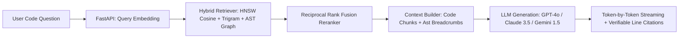

# DevFlow AI — Code Intelligence & AI Architecture Specification

**Document Version:** 1.0.0  
**Target Capabilities:** Tree-sitter AST Parsing, Code Graph, Grounded RAG, Autonomous ReAct Agents, PR Reviewer, Test Generation & Virtual Sandboxing  

---

## 1. Code Intelligence & AST Extractor Pipeline

DevFlow AI processes multi-language repositories (`TypeScript`, `JavaScript`, `Python`, `Java`, `Go`, `Rust`, `SQL`) using Tree-sitter AST parsers to extract semantic structures:

```
[Raw Repository Code]
         │
         ▼
[File Filtering & Ignore Rules] (Excludes binaries, lockfiles, node_modules)
         │
         ▼
[Tree-sitter AST Parser Engine]
         ├──► API Endpoint Extractor (REST routes, DTOs, HTTP verbs)
         ├──► Database Model Extractor (ORM entities, columns, relations)
         ├──► Auth Guard Extractor (JWT guards, RBAC roles, policies)
         ├──► Config Pattern Extractor (Env variables, config files)
         └──► Test Suite Extractor (Suites, assertions, mocks)
         │
         ▼
[Semantic Context Chunker] (Preserves function/class boundaries & breadcrumbs)
         │
         ▼
[Code Graph Builder] (Directed graph of dependencies, callers, implementations)
```

---

## 2. Grounded RAG (Retrieval-Augmented Generation) Pipeline



### Citation Verifiability
Every answer produced by DevFlow AI is deterministically grounded with file path and exact line range citations (e.g. `[auth.service.ts:L18-L45]`). Hallucinations are actively suppressed by strict temperature settings (`0.1`) and system prompts enforcing evidence-backed citations.

---

## 3. Autonomous AI Coding Agents (ReAct Loop)

DevFlow AI incorporates 4 specialized AI software engineering agents:
1. **Code Investigation Agent**: Explores architecture, maps call trees, and traces data flows.
2. **Debugging Agent**: Reproduces failures, pinpoints root causes in AST symbols, executes tests in sandboxes, and synthesizes unified diff patches.
3. **Documentation Agent**: Generates accurate OpenAPI specifications, Markdown guides, and architectural documentation.
4. **Testing Agent**: Synthesizes comprehensive unit, integration, edge, and failure test suites.

### Autonomous ReAct Execution Loop:
```
User Request / Goal
        ↓
Planning & Strategy Selection
        ↓
Controlled Tool Selection (from 11 permitted tools)
        ↓
Tool Execution in Virtual Sandbox
        ↓
Observation & Feedback
        ↓
Next Action Decision (or Patch Generation)
        ↓
Final Evidence-Backed Response
```

### 11 Controlled Agent Tools:
* `search_code(query, mode)`
* `read_file(filePath, startLine, endLine)`
* `search_repository(pattern, fileExtension)`
* `get_symbol(symbolName)`
* `get_git_history(commitLimit)`
* `get_pull_request(prNumber)`
* `run_tests(testTarget, timeoutSeconds)`
* `run_linter(filePath)`
* `create_patch(filePath, originalCode, replacementCode, explanation)`
* `create_branch(branchName, baseBranch)`
* `create_pull_request(title, body, headBranch, baseBranch)`

---

## 4. AI Pull Request Review Engine

When pull requests are opened or updated, DevFlow AI triggers automated multi-dimensional diff analysis:

### 7 Review Categories:
1. **Correctness**: Off-by-one errors, null dereferences, logic edge cases.
2. **Security**: SQL Injection, Command Injection, hardcoded API keys, SSRF risks.
3. **Performance**: N+1 database queries in loops, memory leaks, unindexed scans.
4. **Maintainability**: High cyclomatic complexity, excessive function length.
5. **Code Quality**: Empty catch blocks, leftover debug statements, inconsistent naming.
6. **Testing**: Skipped test suites, missing edge-case assertions.
7. **Architecture**: Unsafe type casts, circular dependencies, layering violations.

---

## 5. AI Test Generation & 1-Click Self-Healing

The 9-step Test Generation Studio:
1. **Analyze Code**: AST & control flow analysis.
2. **Analyze Existing Tests**: Branch discovery.
3. **Identify Dependencies**: Derive mock factories.
4. **Generate Test Cases**: Unit, Integration, Edge cases, Failure cases.
5. **Create Test File**: Jest, Vitest, PyTest formats.
6. **Run Tests in Sandbox**: Enforce CPU/Memory/Timeout limits.
7. **Parse Results**: PASS, FAIL, ERROR, TIMEOUT.
8. **Send Results to AI**: Root cause failure diagnosis.
9. **Suggest Fixes**: 1-click self-healing patch applied to implementation or test code.
