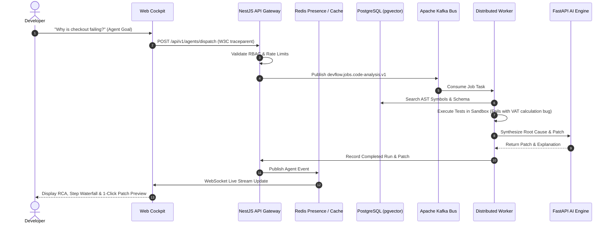

# DevFlow AI — System Architecture Specification

**Document Version:** 1.0.0  
**Status:** Production Ready  
**Target Audience:** Architects, Principal Engineers, Security Auditors  

---

## 1. System Vision & Architecture Principles

DevFlow AI is an enterprise AI-powered collaborative software engineering platform designed to automate codebase comprehension, autonomous debugging, multi-dimensional pull request reviews, test generation with self-healing, and real-time multiplayer editing across multi-million line codebases.

### Core Architectural Principles
1. **Multi-Tenant Isolation**: Tenant boundaries (`workspace_id`) are enforced at the API gateway, database queries, in-memory caches, and vector embeddings.
2. **Context-Aware Semantic Grounding**: Code intelligence is powered by Tree-sitter AST parsing, Code Graphs, and hybrid retrieval with verified file/line citations.
3. **Controlled Agent Autonomy**: Autonomous ReAct agents execute only within strictly controlled tool registries and isolated virtual sandboxes with zero arbitrary shell access.
4. **Resilient Event-Driven Processing**: Long-running ingestion, embedding generation, and PR analysis run asynchronously through partitioned Apache Kafka topics and Redis BullMQ queues with 3-tier exponential backoff retries and Dead-Letter Queues (DLQ).
5. **Deterministic Real-Time Collaboration**: Distributed presence and concurrent engineering documents synchronize deterministically via CRDT vector-clock convergence.

---

## 2. 6-Tier Architecture Blueprint

```
+----------------------------------------------------------------------------------------------------+
|                                 DEVFLOW 6-TIER DISTRIBUTED SYSTEM                                  |
+----------------------------------------------------------------------------------------------------+
|  [Tier 1: Web Cockpit]       Next.js 14 App Router, Radix UI, TailwindCSS, WebSocket Client        |
|                                       │                                                            |
|                                       ▼ HTTP REST / WSS (W3C traceparent)                          |
|  [Tier 2: API Gateway]       NestJS Modular Monolith, JWT Auth, RBAC, Rate Limiter, SSRF Shield    |
|                                       ├──► [Tier 3: Distributed Cache] Redis 7 Presence & Caching  |
|                                       ├──► [Tier 4: Vector Database] PostgreSQL 16 + pgvector HNSW  |
|                                       └──► [Tier 5: Distributed Queue] Apache Kafka Partitioned Bus|
|                                                 │                                                  |
|                                                 ▼ Event Consume                                    |
|  [Tier 6A: Distributed Worker]  Sandboxed Execution Worker Pool (gVisor / Isolated Containers)      |
|                                                 │                                                  |
|                                                 ▼ LLM RPC Query                                    |
|  [Tier 6B: AI Service Engine]   FastAPI Python 3.11, PyTorch, AST Embeddings, LLM RAG Pipeline     |
+----------------------------------------------------------------------------------------------------+
```

---

## 3. Subsystem Breakdown

### Tier 1: Frontend Web Cockpit (`apps/web`)
* **Technology**: Next.js 14 (App Router), React 18, TailwindCSS, Radix UI, Lucide Icons.
* **Key Modules**:
  * **Interactive Code Chat**: Streaming token-by-token RAG interface with syntax-highlighted code blocks and interactive citation drawers.
  * **Autonomous Agent Control Room**: Step-by-step reasoning waterfall, tool observation cards, and 1-click patch preview diffs.
  * **PR Review Cockpit**: Multi-category finding filters (Security, Performance, Correctness), inline suggestion diffs, and GitHub publishing buttons.
  * **AI Test Studio**: Interactive test matrix (Unit, Integration, Edge, Failure), sandboxed execution status badges, and 1-click self-healing patch applicator.
  * **Real-Time Collaboration**: Active presence avatars, live cursor tracking, CRDT collaborative note editor with Markdown support.
  * **Observability Dashboard**: Prometheus telemetry meters, P50/P95/P99 latency distribution cards, 6-tier waterfall trace explorer, and audit logs.

### Tier 2: API Gateway & Core Monolith (`apps/api`)
* **Technology**: NestJS 10, TypeScript, TypeORM, RxJS.
* **Key Modules**:
  * `AuthModule`: Multi-tenant registration, login, JWT token rotation, RBAC roles guard.
  * `WorkspacesModule`: Tenant workspace CRUD, member invitations, role management.
  * `GitHubModule`: GitHub App OAuth, repository linking, webhook HMAC signature verification (`x-hub-signature-256`).
  * `IngestionModule`: Multi-language codebase discovery, Tree-sitter AST parsing, chunking, and metadata indexing.
  * `IntelligenceModule`: Code Graph builder, Hybrid Search (Keyword + Symbol + Semantic), RAG query processor, conversation manager.
  * `AgentsModule`: Autonomous ReAct agent orchestrator, 11 controlled tools, guardrails, and virtual sandbox.
  * `ReviewsModule`: 7-category PR review analyzer, test synthesizer, GitHub inline comment publisher.
  * `TestsModule`: 9-step test generator, sandboxed test runner, AI failure diagnosis, and self-healing engine.
  * `CollaborationModule`: Redis presence tracker, CRDT vector clock engine, comments, mentions, and activity feed.
  * `ObservabilityModule`: Prometheus metrics collector, W3C OpenTelemetry distributed tracer, and security audit log repository.

### Tier 3: Distributed In-Memory Cache (`Redis 7.2`)
* Redis Pub/Sub for distributed WebSocket state synchronization.
* Sliding-window token bucket rate limiting.
* Multi-user workspace presence registry (`presence:{workspaceId}:{userId}`).
* L2 query embedding cache to eliminate redundant vector embedding computations.

### Tier 4: Relational & Vector Database (`PostgreSQL 16 + pgvector`)
* Relational multi-tenant schema with foreign key cascades.
* `pgvector` HNSW index (`m = 16, ef_construction = 64`) on 1536-dimensional embedding vectors for sub-3ms cosine lookups.
* GIN trigram indexes (`gin_trgm_ops`) on chunk content and composite B-tree indexes on symbols and file paths.

### Tier 5: Distributed Message Bus (`Apache Kafka & Redis BullMQ`)
* Partitioned Kafka topics for horizontal scaling:
  * `devflow.jobs.repository-index.v1`
  * `devflow.jobs.code-analysis.v1`
  * `devflow.jobs.embedding-generation.v1`
  * `devflow.jobs.test-execution.v1`
  * `devflow.jobs.ai-review.v1`
  * `devflow.jobs.documentation.v1`
* 3-tier exponential backoff retry queues (`devflow.jobs.retry.1.v1`, `2`, `3`).
* Dead-Letter Queue (DLQ) for non-retryable and exhausted failures.

### Tier 6: AI Engine & Sandboxed Execution (`apps/ai-service`)
* **Technology**: FastAPI, Python 3.11, PyTorch, Hugging Face Transformers, RFC 7807 problem details.
* Vector embedding generation (`text-embedding-3-small` / local transformer models).
* Multi-LLM provider integration with fallback chaining (`GPT-4o`, `Claude 3.5 Sonnet`, `Gemini 1.5 Pro`).
* Virtual container isolation for untrusted repository code execution and test verification.

---

## 4. End-to-End Data Flow



---

## 5. Security Architecture Summary

1. **Authentication**: Bcrypt hashing (`cost = 10`), JWT RS256/HS256 tokens (15m access / 7d rotating refresh).
2. **Authorization**: RBAC Guards on all REST and WebSocket handlers.
3. **SSRF Protection**: Strict IP/domain blocklist on all outbound integration requests.
4. **Secret Sanitization**: Automated runtime scrubbing of keys (`sk-***`, `ghp_***`, `Bearer ***`).
5. **Code Execution Isolation**: Ephemeral virtual sandboxes with CPU/memory/time quotas.
6. **Audit Logging**: Immutable event log of all administrative, security, and AI actions.
