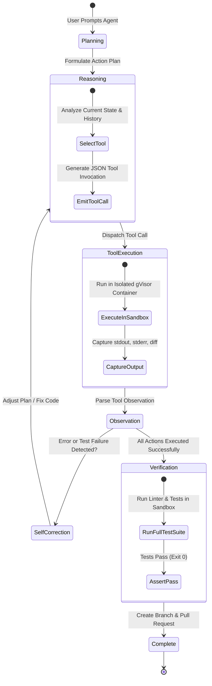
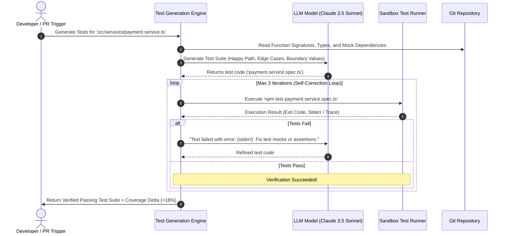
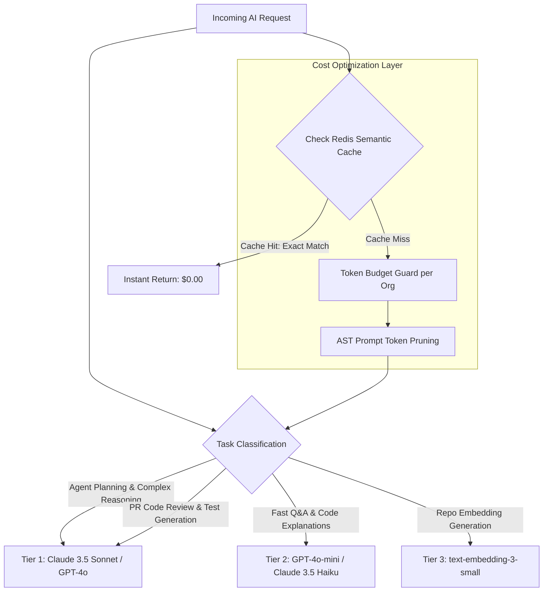

# DEVFLOW AI — Artificial Intelligence & Agent Architecture Specification

> **System Name**: DEVFLOW AI  
> **Document Version**: 1.0.0  
> **Component**: AI Intelligence Engine, RAG Pipeline & Autonomous Agent Runtime (Python FastAPI)  
> **Author**: Senior Software Architect

---

## 1. AI Architecture Overview & Python Service

DEVFLOW AI separates core business domain logic from high-compute AI operations by hosting all LLM interactions, AST parsing, embeddings, and agent loops inside a dedicated **Python 3.11 FastAPI service** (`apps/ai-service`).

```mermaid
graph TD
    subgraph Client & Gateway
        WebClient[Next.js Client]
        NestAPI[NestJS Core API]
        KafkaBus[[Kafka Event Bus]]
    end

    subgraph Python AI Engine (apps/ai-service)
        FastAPIGW[FastAPI Router & Controller]

        subgraph Subsystems
            ASTParser[Tree-sitter AST & Symbol Extractor]
            RAGPipeline[Hybrid Retrieval & Re-ranking Engine]
            AgentRuntime[ReAct Agent State Machine]
            ReviewEngine[Semantic Code Reviewer]
            TestGenEngine[Test Synthesizer & Mutation Loop]
        end

        LLMGateway[LLM Gateway & Semantic Cache]
    end

    subgraph Sandboxed Execution Pool
        SandboxRunner[gVisor / Docker Ephemeral Sandbox Runner]
    end

    subgraph Persistent Storage
        PGVector[(PostgreSQL 16 + pgvector)]
        RedisCluster[(Redis 7.2 Cache & Locks)]
    end

    subgraph External LLMs
        OpenAI[OpenAI: GPT-4o / text-embedding-3]
        Anthropic[Anthropic: Claude 3.5 Sonnet]
    end

    NestAPI -->|gRPC / Internal REST| FastAPIGW
    KafkaBus -->|Consume Async Events| FastAPIGW

    FastAPIGW --> ASTParser
    FastAPIGW --> RAGPipeline
    FastAPIGW --> AgentRuntime
    FastAPIGW --> ReviewEngine
    FastAPIGW --> TestGenEngine

    RAGPipeline --> PGVector
    RAGPipeline --> LLMGateway
    AgentRuntime --> SandboxRunner
    AgentRuntime --> LLMGateway
    ReviewEngine --> LLMGateway
    TestGenEngine --> SandboxRunner

    LLMGateway <-->|Semantic Cache| RedisCluster
    LLMGateway --> OpenAI
    LLMGateway --> Anthropic
```

---

## 2. Codebase RAG Pipeline & Semantic Indexing

Standard text-based RAG fails on source code because it ignores syntax boundaries and structural relationships. DEVFLOW AI uses an **AST-aware multi-stage indexing and hybrid retrieval pipeline**:

```mermaid
flowchart TD
    RepoClone[Git Repository Ingestion / Webhook] --> LangDetect{Detect Languages}
    LangDetect -->|TS/JS, Python, Go, Rust, Java| TreeSitter[Tree-sitter AST Parser]

    TreeSitter --> SemanticChunk[Semantic Chunking: Functions, Classes, Enums]
    TreeSitter --> SymbolGraph[Extract Symbol Table & Call Graph]

    SemanticChunk --> ContextEnrich[Context Enrichment: File Path, Enclosing Scope, Imports]
    ContextEnrich --> EmbedBatch[Batch Embedding Generator: text-embedding-3-small]

    EmbedBatch --> PGStore[(Store in PostgreSQL: pgvector + AST Metadata)]
    SymbolGraph --> PGStore

    subgraph Hybrid Retrieval Flow
        UserQuery[User Query / Agent Prompt] --> QueryEmbed[Generate Query Embedding]
        UserQuery --> BM25Extract[Extract Lexical Keywords & Regex]

        QueryEmbed --> DenseSearch[pgvector HNSW Cosine Search]
        BM25Extract --> SparseSearch[pg_trgm Lexical Search]

        DenseSearch --> RRF[Reciprocal Rank Fusion (RRF)]
        SparseSearch --> RRF

        RRF --> Reranker[Cross-Encoder Re-ranker: Cohere / BGE]
        Reranker --> TopKContext[Top-K High Precision Code Context]
    end
```

### 2.1 AST Semantic Chunking Rules

1. **Never split mid-function or mid-block**: Chunk boundaries strictly align with AST node boundaries (`function_declaration`, `class_declaration`, `method_definition`).
2. **Context Enrichment Header**: Every embedded chunk is prepended with file context metadata:

```typescript
// File: src/auth/jwt.strategy.ts | Module: AuthModule | Scope: JwtStrategy.validate()
// Imports: { PassportStrategy, ExtractJwt } from '@nestjs/passport'
async validate(payload: JwtPayload): Promise<UserSession> { ... }
```

3. **Chunk Size Limits**: Hard ceiling of 512 tokens per chunk. Functions exceeding 512 tokens are decomposed into logical sub-blocks while maintaining outer signature headers.

---

## 3. Autonomous Coding Agent Architecture

The coding agent executes multi-step software engineering tasks using an enhanced **ReAct (Reasoning + Acting) state machine** with deterministic tool calling and sandbox verification.



### 3.1 Agent Tool Catalog & Interfaces

| Tool Name          | Input Parameters                                 | Execution Environment   | Description                                                             |
| :----------------- | :----------------------------------------------- | :---------------------- | :---------------------------------------------------------------------- |
| `search_codebase`  | `query: str, lang?: str, top_k?: int`            | AI Service / pgvector   | Performs hybrid semantic + lexical search across repository chunks.     |
| `read_file_range`  | `file_path: str, start_line: int, end_line: int` | Workspace Filesystem    | Reads specific lines of a source file with syntax highlighting.         |
| `ast_find_symbols` | `symbol_name: str, symbol_type?: str`            | PostgreSQL Symbol Table | Locates all declarations, implementations, and call sites of a symbol.  |
| `apply_patch`      | `file_path: str, unified_diff: str`              | Local Git Working Tree  | Applies an exact GNU unified diff patch to a target file.               |
| `run_linter`       | `file_paths: list[str]`                          | Sandbox Container       | Runs language linters (ESLint, Ruff, GolangCI-Lint) and returns errors. |
| `run_test_suite`   | `test_path?: str, timeout_sec?: int`             | Sandbox Container       | Runs test framework (Jest, Pytest, Go Test) and captures test output.   |
| `create_pr`        | `title: str, body: str, branch_name: str`        | GitHub App Client       | Publishes git commits, pushes remote branch, and opens a GitHub PR.     |

---

## 4. Sandboxed Code Execution Engine

Running untrusted agent-generated code requires strict multi-tenant isolation:

```mermaid
graph TD
    AgentTask[Agent invokes 'run_test_suite' or 'run_linter'] --> AgentRunner[Sandbox Dispatcher]
    AgentRunner --> ContainerPool[Ephemeral gVisor Container Pool]

    subgraph Isolated Sandbox Container
        gVisor[gVisor runsc Kernel Sandbox]
        NonRoot[Non-Root User: devflow]
        MemLimit[Memory Ceiling: 1024MB]
        CPULimit[CPU Quota: 1 Core]
        ReadOnlyFS[Read-Only Root Filesystem]
        TmpFS[Ephemeral /tmp 256MB]
        NoEgress[Zero Outbound Network Access]
    end

    ContainerPool --> gVisor
    gVisor --- NonRoot
    gVisor --- MemLimit
    gVisor --- CPULimit
    gVisor --- ReadOnlyFS
    gVisor --- TmpFS
    gVisor --- NoEgress

    Isolated Sandbox Container --> Results[Stdout / Stderr / Return Code (Timeout: 60s)]
    Results --> AgentRunner
```

---

## 5. AI Code Review Engine

When a GitHub Pull Request is opened or synchronized, the AI Review Engine analyzes the unified diff using a multi-perspective evaluation framework:

```mermaid
graph LR
    PRDiff[GitHub PR Diff] --> ASTEnrich[AST Context Enrichment]
    ASTEnrich --> EvalSplitter{Parallel Analysis Passes}

    EvalSplitter --> SecCheck[1. Security & OWASP Scanner<br/>SQLi, XSS, SSRF, Leaked Keys]
    EvalSplitter --> PerfCheck[2. Performance & Complexity<br/>N+1 Queries, Memory Leaks, O(n^2)]
    EvalSplitter --> ArchCheck[3. Architecture & Style<br/>Naming, Modularity, Typing]
    EvalSplitter --> TestCheck[4. Test Completeness<br/>Missing Edge Cases, Assertions]

    SecCheck --> Aggregator[Findings Aggregator & Scorer]
    PerfCheck --> Aggregator
    ArchCheck --> Aggregator
    TestCheck --> Aggregator

    Aggregator --> OutputGen[Generate Inline Comments + Suggested Diffs]
    OutputGen --> GitHubAPI[Post to GitHub PR via Octokit]
```

---

## 6. AI Test Generation & Self-Correction Engine

DEVFLOW AI automatically synthesizes robust unit and integration tests using an **iterative synthesis and sandbox verification loop**:



---

## 7. LLM Gateway, Routing & Cost Optimization

To balance inference speed, reasoning depth, and operational costs, DEVFLOW AI routes requests dynamically across model tiers:



### 7.1 Cost Optimization Metrics & Impact

- **Redis Semantic Caching**: Caches identical queries/diff reviews, reducing duplicate LLM calls by ~35%.
- **AST Context Pruning**: Strips irrelevant function bodies before sending code prompts to LLMs, reducing input prompt tokens by ~55%.
- **Tiered Routing**: Directs simple classification and title generation tasks to lightweight mini-models, slashing per-request token costs by ~80%.
