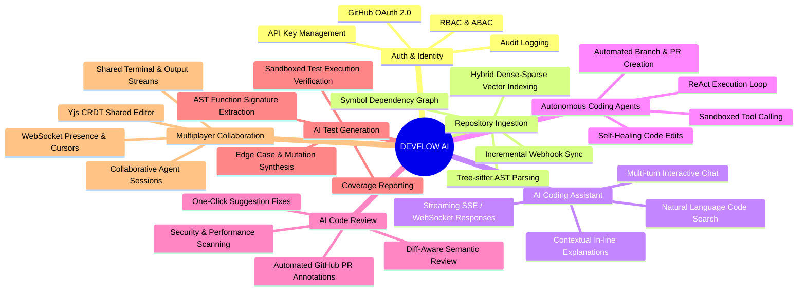
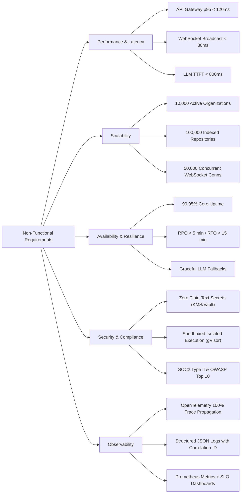
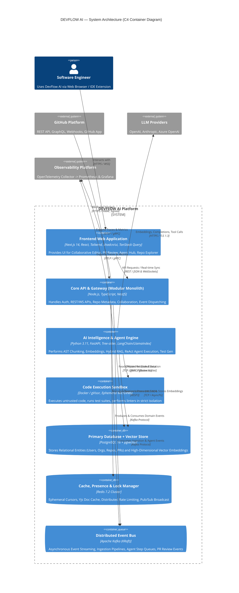
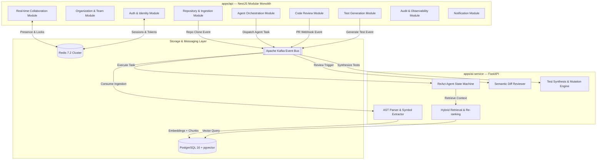
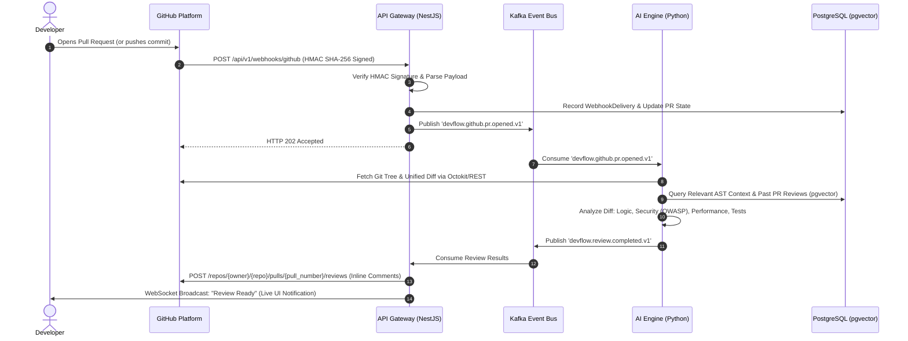
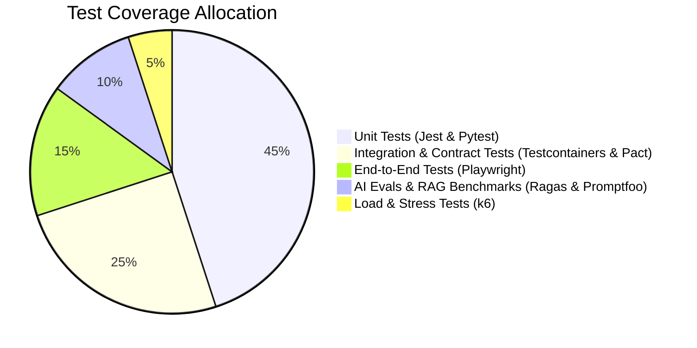
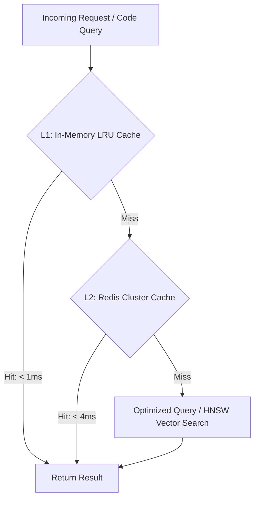
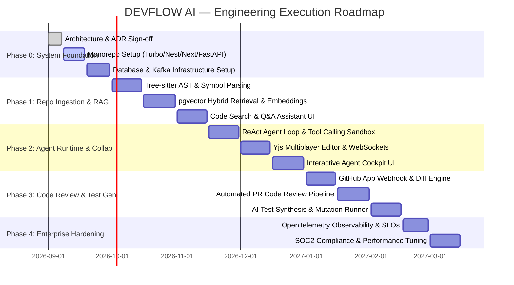

# DEVFLOW AI — Master System Architecture Document

> **System Name**: DEVFLOW AI  
> **Document Version**: 1.0.0 (Production Blueprint)  
> **Author**: Senior Software Architect  
> **Target Audience**: Software Engineers, Backend Engineers, Full-Stack Engineers, AI Engineers, DevOps/SRE  
> **Classification**: Technical Architecture Specification

---

## Table of Contents

1. [Executive Summary & Vision](#1-executive-summary--vision)
2. [Product Requirements Document (PRD)](#2-product-requirements-document-prd)
3. [Functional Requirements](#3-functional-requirements)
4. [Non-Functional Requirements (NFRs)](#4-non-functional-requirements-nfrs)
5. [System Architecture Overview](#5-system-architecture-overview)
6. [Service & Module Boundaries](#6-service--module-boundaries)
7. [GitHub Integration Architecture](#7-github-integration-architecture)
8. [WebSocket & Real-time Collaboration Architecture](#8-websocket--real-time-collaboration-architecture)
9. [Repository & Monorepo Structure](#9-repository--monorepo-structure)
10. [API Architecture & Protocols](#10-api-architecture--protocols)
11. [Testing Strategy](#11-testing-strategy)
12. [Performance Strategy](#12-performance-strategy)
13. [Failure Handling & Resilience Strategy](#13-failure-handling--resilience-strategy)
14. [Development Roadmap](#14-development-roadmap)

---

## 1. Executive Summary & Vision

**DEVFLOW AI** is a cloud-native, AI-augmented collaborative software engineering platform designed to unify the end-to-end developer lifecycle. By combining deep codebase semantic indexing (AST + RAG), autonomous coding agents, intelligent PR code reviews, automated test synthesis, and real-time multiplayer collaboration, DEVFLOW AI eliminates developer context-switching and automates repetitive engineering workflows.

### Target Personas & Portfolio Alignment

- **Software Engineers & Full-Stack Developers**: Real-time collaborative workspace, intelligent IDE sidecar, automated test generation, and instant code refactoring.
- **Backend Engineers**: High-throughput event-driven workflows, resilient asynchronous orchestration, transactional data integrity, and strict modular boundaries.
- **AI Engineers**: Tree-sitter AST parsing, hybrid dense-sparse vector retrieval, ReAct-based agentic workflows, deterministic tool calling, and automated evaluation pipelines.
- **Engineering Leads & DevOps**: Zero-friction GitHub App integration, automated security & semantic PR reviews, OpenTelemetry observability, and sandboxed isolated execution.

---

## 2. Product Requirements Document (PRD)

### 2.1 Core Problem Statement

Modern software engineering teams face severe friction:

1. **Context Fragmentation**: Developers constantly jump between GitHub, IDEs, terminal runners, code review tools, and communication channels.
2. **Codebase Opacity**: Onboarding and cross-service navigation require parsing thousands of files with zero semantic or architectural assistance.
3. **Review & Test Bottlenecks**: Pull requests sit idle for days awaiting review; unit and integration test coverage is chronically neglected due to time pressure.
4. **Isolated Workflows**: Pair programming and collaborative troubleshooting lack real-time synchronization with active AI agents.

### 2.2 Product Value Proposition

DEVFLOW AI provides a unified cockpit featuring:

- **Deep Codebase Awareness**: Continuous indexing of Git repositories using Abstract Syntax Tree (AST) decomposition, symbol graph mapping, and hybrid vector search.
- **Autonomous Task Agents**: Multi-step AI agents capable of planning, executing AST-aware edits, running linters, executing test suites in secure sandboxes, and publishing clean GitHub pull requests.
- **Continuous Intelligent Code Review**: Automated webhook-driven PR analysis identifying logic bugs, security vulnerabilities (OWASP), performance regressions, and architectural anti-patterns.
- **Multiplayer Workspace**: Sub-30ms collaborative code editor with real-time cursor tracking, shared agent sessions, and active execution logs.

---

## 3. Functional Requirements



### 3.1 Detailed Feature Matrix

| Functional Area               | Feature Description                                                                                | Input / Trigger                                    | Output / Result                                                  |
| :---------------------------- | :------------------------------------------------------------------------------------------------- | :------------------------------------------------- | :--------------------------------------------------------------- |
| **FR-01: Identity & Access**  | Multi-tenant authentication, GitHub App link, RBAC (Admin, Lead, Developer, Viewer).               | OAuth 2.0 login / invite token                     | Signed JWT (access + refresh), session in Redis.                 |
| **FR-02: Repo Ingestion**     | Full repository cloning, branch sync, AST chunking, symbol extraction, vector embedding.           | User connects repo / GitHub push webhook           | Partitioned embeddings in pgvector, indexed code graph.          |
| **FR-03: Codebase RAG**       | Natural language query retrieval combining dense vector similarity and BM25 lexical match.         | Developer prompt in search / chat                  | Top-k re-ranked code snippets with AST context.                  |
| **FR-04: Coding Agents**      | Multi-step agent decomposes feature request, reads code, drafts patches, tests in sandbox.         | User prompt: "Add idempotency to payment endpoint" | Verified branch, diff review, automated PR creation.             |
| **FR-05: AI Code Review**     | Automated PR review analyzing AST diffs, static analysis results, security rules, and performance. | GitHub `pull_request.opened` / `synchronize`       | Inline GitHub PR review comments with suggested diffs.           |
| **FR-06: AI Test Generation** | Automated unit/integration test synthesis for modified or target files with verification loop.     | User button click / PR review trigger              | Passing test suite with verified assertions and coverage report. |
| **FR-07: Real-time Collab**   | Multiplayer code editing, cursor presence, shared terminal output, live agent streaming.           | User typing / cursor movement / agent execution    | Sub-30ms Yjs CRDT synchronization across connected clients.      |
| **FR-08: Task Orchestration** | Asynchronous job management for heavy repo ingestion, agent runs, and test executions.             | API / Kafka events                                 | Distributed job lifecycle tracking with live progress events.    |

---

## 4. Non-Functional Requirements (NFRs)



### 4.1 Latency Budgets & Performance Metrics

- **Standard REST/GraphQL Endpoints**: p50 < 40ms, p95 < 120ms, p99 < 300ms.
- **WebSocket Presence & Cursor Broadcast**: p95 < 30ms under 5,000 active connections per node.
- **AI Streaming Response Time to First Token (TTFT)**: p95 < 800ms via SSE / WebSocket stream.
- **Vector Similarity Search (pgvector HNSW)**: p95 < 35ms for top-20 nearest neighbors across 5,000,000 vectors.
- **Full Repo Indexing Throughput**: > 5,000 source files ingested, parsed, and embedded per minute.

### 4.2 Scalability & Target Capacity

- **Tenancy Model**: Multi-tenant with logical organization and workspace isolation.
- **Concurrent Users**: Designed to sustain 50,000 simultaneous active WebSocket connections horizontally across 10 Gateway nodes.
- **Repository Storage**: 100,000+ active repositories, scaling to petabyte-scale chunk metadata.
- **Kafka Event Bus**: 10,000 messages/sec peak throughput with zero partition lag.

### 4.3 High Availability & Fault Tolerance

- **Core API Uptime**: 99.95% SLA (monthly downtime < 21.9 minutes).
- **Database Disaster Recovery**: Multi-AZ RDS PostgreSQL deployment with automated failover (< 60s), RPO < 5 minutes, RTO < 15 minutes.
- **Degraded Operations Mode**: If LLM providers experience an outage, the system degrades gracefully by falling back to secondary providers (Anthropic -> OpenAI -> Azure) while maintaining non-AI platform operations.

---

## 5. System Architecture Overview

DEVFLOW AI adopts a **Modular Monolith architecture for core business domain logic and API orchestration (NestJS)** paired with a **Decoupled Asynchronous AI Engine (Python FastAPI)** and an **Ephemeral Sandboxed Execution Pool (gVisor/Docker)**, coordinated via **Apache Kafka** and **Redis**.

### 5.1 High-Level Container Diagram (C4 Level 2)



---

## 6. Service & Module Boundaries

### 6.1 Architectural Rationale: Modular Monolith vs. Premature Microservices

DEVFLOW AI deliberately uses a **Modular Monolith** architecture for the primary platform backend (`apps/api` in NestJS) while separating compute-heavy, language-specialized workloads into a dedicated **AI Intelligence Engine** (`apps/ai-service` in Python).

- **Why this pattern?**
  - Avoids distributed transaction anti-patterns and network serialization overhead during core business entity transactions.
  - Allows strict internal module boundaries via TypeScript interfaces and NestJS dependency injection.
  - Python is reserved for the AI subsystem where the AST (Tree-sitter), Vector Math (NumPy/PyTorch), and LLM ecosystem is mature.
  - As specific modules (e.g., `CodeReviewModule` or `RepositoryModule`) scale independently, their defined event contracts allow seamless extraction into standalone microservices.



### 6.2 Module Responsibility & Domain Boundaries

| Module                       | Bounded Context                                        | Inbound Dependencies                       | Outbound Events                                                     |
| :--------------------------- | :----------------------------------------------------- | :----------------------------------------- | :------------------------------------------------------------------ |
| **AuthModule**               | Users, Credentials, GitHub OAuth, API Keys, Sessions   | None                                       | `user.created`, `user.login`, `apikey.revoked`                      |
| **OrganizationModule**       | Multi-tenant Orgs, Workspaces, Memberships, RBAC       | AuthModule                                 | `organization.created`, `member.invited`                            |
| **RepositoryModule**         | Git Repos, Branches, Commits, File Tree Metadata       | OrganizationModule                         | `repo.connected`, `repo.sync.requested`, `repo.deleted`             |
| **CollaborationModule**      | Yjs Document State, WebSockets, Active Cursors, Rooms  | AuthModule, OrganizationModule             | `collab.room.joined`, `collab.room.left`                            |
| **AgentOrchestrationModule** | Agent Task Lifecycles, ReAct Steps, User Approvals     | RepositoryModule, AuthModule               | `agent.task.created`, `agent.step.approved`, `agent.task.completed` |
| **CodeReviewModule**         | PR Diffs, Review Runs, Security Scans, Inline Comments | RepositoryModule, GitHubApp                | `review.requested`, `review.completed`, `comment.posted`            |
| **TestGenerationModule**     | Test Suites, Test Cases, Mutation Runs, Coverage Logs  | RepositoryModule, AgentOrchestrationModule | `test.gen.requested`, `test.run.completed`                          |
| **AuditModule**              | Compliance Logs, Security Trails, Activity Stream      | All Modules                                | `audit.log.recorded`                                                |

---

## 7. GitHub Integration Architecture

The GitHub integration handles bidirectional synchronization between GitHub repositories and DEVFLOW AI via an official **GitHub App**.



### 7.1 Security & Webhook Processing Rules

1. **HMAC Verification**: Every incoming webhook is validated against the GitHub App Webhook Secret using `crypto.createHmac('sha256', secret)`.
2. **Installation Token Lifecycle**: Ephemeral installation tokens (valid for 60 minutes) are minted on demand using the App's RSA private key (`RS256`) and cached in Redis with a 50-minute TTL.
3. **Idempotency & Replay Prevention**: Webhook deliveries are deduplicated using the unique `X-GitHub-Delivery` GUID stored in Redis with a 24-hour expiration.

---

## 8. WebSocket & Real-time Collaboration Architecture

DEVFLOW AI enables multiplayer code editing and live streaming of AI agent execution steps via **Socket.IO over WebSockets**, backed by the **Redis Pub/Sub Adapter** and **Yjs CRDTs**.

```mermaid
graph TD
    Client1[Client A: Dev Browser] <-->|WSS Connection| Node1[API Gateway Node 1]
    Client2[Client B: Dev Browser] <-->|WSS Connection| Node2[API Gateway Node 2]
    Client3[Client C: Dev Browser] <-->|WSS Connection| Node1

    Node1 <-->|Redis Pub/Sub Stream| RedisCluster[(Redis 7.2 Cluster)]
    Node2 <-->|Redis Pub/Sub Stream| RedisCluster

    subgraph Real-Time Engine (Per Node)
        YjsHandler[Yjs CRDT Document Manager]
        PresenceEngine[Ephemeral Cursor & Presence Tracker]
        AgentStreamer[LLM Token / Tool Call Event Streamer]
    end

    Node1 --- YjsHandler
    Node1 --- PresenceEngine
    Node1 --- AgentStreamer
```

### 8.1 Real-Time Synchronization Protocols

- **Document State Synchronization**: Handled via Yjs binary protocol (`y-websocket` message encoding). State vectors are exchanged on connect, followed by delta updates.
- **Snapshot Persistence**: Document state is periodically compacted and persisted from Redis to PostgreSQL every 60 seconds of inactivity or upon session closure.
- **Presence & Heartbeats**: Cursors, active file focus, and selections are stored in Redis Hashes (`presence:workspace:{id}`) with a 15-second TTL, refreshed every 5 seconds via client heartbeat.
- **Agent Output Streaming**: As LLMs yield tokens and tool execution results, events are published to Redis Pub/Sub channels (`stream:agent:{sessionId}`) and relayed to all connected room members.

---

## 9. Repository & Monorepo Structure

The project is structured as a **Turborepo monorepo** with strict dependency boundaries:

```
devflow-ai/
├── .github/
│   ├── workflows/
│   │   ├── ci.yml               # Lint, typecheck, test, security audit
│   │   ├── cd-staging.yml       # Automated staging deployment
│   │   └── cd-prod.yml          # Production canary deployment
│   └── dependabot.yml
├── apps/
│   ├── web/                     # Next.js 14 Web Application
│   │   ├── src/
│   │   │   ├── app/             # App Router (pages, layouts, route handlers)
│   │   │   ├── components/      # React UI Components (shadcn/ui + custom)
│   │   │   ├── hooks/           # Custom React Hooks (TanStack Query, Collab)
│   │   │   ├── lib/             # Utility functions, API clients, Zod schemas
│   │   │   └── styles/          # Tailwind CSS global design system
│   │   ├── Dockerfile
│   │   ├── package.json
│   │   └── tsconfig.json
│   ├── api/                     # NestJS Core Modular Monolith
│   │   ├── src/
│   │   │   ├── modules/         # Bounded Context Modules (Auth, Repo, Collab, etc.)
│   │   │   ├── common/          # Interceptors, Filters, Guards, Decorators, Pipes
│   │   │   ├── config/          # Environment variable validation (Zod)
│   │   │   ├── database/        # TypeORM / Prisma / Drizzle Entities & Migrations
│   │   │   ├── main.ts          # Application Entrypoint & Bootstrap
│   │   │   └── app.module.ts    # Root Monolith Module
│   │   ├── test/                # E2E and Integration Tests
│   │   ├── Dockerfile
│   │   ├── package.json
│   │   └── tsconfig.json
│   └── ai-service/              # Python FastAPI Intelligence Service
│       ├── app/
│       │   ├── api/             # FastAPI Routers (RAG, Agents, Review, TestGen)
│       │   ├── core/            # Config, Settings, LLM Client Factory
│       │   ├── parser/          # Tree-sitter AST Parsers & Chunking logic
│       │   ├── rag/             # Hybrid Dense-Sparse Indexing & Re-ranking
│       │   ├── agents/          # ReAct State Machine, Tools, Sandbox Runner
│       │   └── schemas/         # Pydantic v2 Models & Kafka Event Payloads
│       ├── tests/               # Pytest Unit & RAG Evals (Ragas)
│       ├── Dockerfile
│       ├── requirements.txt
│       └── pyproject.toml
├── packages/
│   ├── types/                   # Shared TypeScript Interfaces & DTOs
│   ├── config/                  # Shared ESLint, Prettier, TSConfig
│   ├── database/                # Database Schemas, Migrations & Seeds
│   └── ui/                      # Shared Reusable UI Component Library
├── infra/
│   ├── docker/                  # Docker Compose for local development
│   │   ├── docker-compose.yml
│   │   ├── Dockerfile.sandbox   # Ephemeral execution container image
│   │   └── init-pgvector.sql
│   ├── k8s/ / terraform/        # Production Infrastructure as Code
│   └── monitoring/              # Prometheus, Grafana, OpenTelemetry configs
├── docs/
│   └── architecture/            # Architecture Documentation & ADRs
├── turbo.json
├── package.json
└── README.md
```

---

## 10. API Architecture & Protocols

DEVFLOW AI exposes a uniform **RESTful API (OpenAPI 3.1)** for standard CRUD operations and **WebSockets** for real-time collaboration and streaming.

```mermaid
graph LR
    Client[Client Apps / Web / CLI] -->|HTTPS REST| APIGW[API Gateway / NestJS]
    Client -->|WSS WebSockets| APIGW
    APIGW -->|Internal gRPC / HTTP| AIService[Python AI Service]

    subgraph API Conventions
        V1[/api/v1/...]
        RFC7807[RFC 7807 Error Responses]
        CursorPag[Cursor-based Pagination]
        RateHdr[RateLimit-* Headers]
    end
```

### 10.1 Key API Endpoints Specification

| Method | Endpoint                                   | Description                                | Auth Scope      |
| :----- | :----------------------------------------- | :----------------------------------------- | :-------------- |
| `POST` | `/api/v1/auth/github`                      | Authenticate / exchange GitHub code        | Public          |
| `GET`  | `/api/v1/organizations/{orgId}/workspaces` | List active team workspaces                | `org:read`      |
| `POST` | `/api/v1/repositories/sync`                | Trigger asynchronous repo re-indexing      | `repo:write`    |
| `POST` | `/api/v1/agents/tasks`                     | Initialize an autonomous coding agent task | `agent:execute` |
| `GET`  | `/api/v1/agents/tasks/{taskId}/steps`      | Fetch agent step execution timeline        | `agent:read`    |
| `POST` | `/api/v1/code-reviews/trigger`             | Manually dispatch PR review analysis       | `review:write`  |
| `POST` | `/api/v1/test-gen/synthesize`              | Trigger AI test suite generation           | `test:write`    |
| `GET`  | `/api/v1/search/code`                      | Hybrid semantic + lexical code search      | `repo:read`     |

### 10.2 Standard Error Format (RFC 7807)

```json
{
  "type": "https://api.devflow.ai/errors/rate-limit-exceeded",
  "title": "Rate Limit Exceeded",
  "status": 429,
  "detail": "Organization 'org_99x' has exceeded its quota of 500 AI agent calls per hour.",
  "instance": "/api/v1/agents/tasks",
  "code": "ORGANIZATION_QUOTA_EXCEEDED",
  "timestamp": "2026-09-06T20:58:00Z",
  "traceId": "00-4bf92f3577b34da6a3ce929d0e0e4736-00f067aa0ba902b7-01"
}
```

---

## 11. Testing Strategy

DEVFLOW AI adopts a rigorous multi-tier testing strategy covering traditional software layers and non-deterministic AI pipelines:



1. **Unit Tests (Fast Feedback, < 60s)**:
   - TypeScript: Jest / Vitest for React components, NestJS services, and utility functions.
   - Python: Pytest for AST parsing, chunking logic, and prompt template rendering.
2. **Integration Tests (Testcontainers)**:
   - Spins up real PostgreSQL (with pgvector), Redis, and Kafka in Docker containers to validate database repositories, cache logic, and consumer group commit semantics.
3. **AI Evaluation & Benchmarking (Ragas & Promptfoo)**:
   - **Faithfulness**: Verifies AI responses cite valid codebase AST symbols without hallucinations.
   - **Context Recall & Precision**: Measures RAG search accuracy against ground-truth golden code datasets.
   - **Syntax & Mutation Integrity**: Checks that generated code and tests compile and achieve expected coverage.
4. **End-to-End Tests (Playwright)**:
   - Full browser automation testing multi-user collaborative editing, agent task initialization, and GitHub webhook simulation.
5. **Load & Stress Testing (k6)**:
   - Validates system stability under 10,000 requests/sec API load and 50,000 concurrent WebSocket connections.

---

## 12. Performance Strategy



1. **Multi-Tier Caching Architecture**:
   - **L1 In-Memory**: High-frequency metadata (user roles, feature flags) cached in application memory (TTL 30s).
   - **L2 Distributed Redis**: Repository file trees, user sessions, and LLM semantic cache (cached embeddings of frequent queries).
   - **L3 Database Indexing**: Composite B-tree indexes for relational filters; HNSW indexes for vector similarity.
2. **Connection Pooling**:
   - PgBouncer manages PostgreSQL connection pooling to handle up to 5,000 concurrent server connections with minimal memory overhead.
3. **Chunk Streaming & SSE**:
   - All AI completions and agent logs use HTTP Server-Sent Events (SSE) or WebSockets to minimize Time-to-First-Token (TTFT) perceived latency.

---

## 13. Failure Handling & Resilience Strategy

| Failure Scenario                  | Mitigation Mechanism                                           | Recovery Action                                                                                     |
| :-------------------------------- | :------------------------------------------------------------- | :-------------------------------------------------------------------------------------------------- |
| **Primary Database Failover**     | Multi-AZ RDS with automated DNS failover                       | Connection pool automatically reconnects within 45s; read-replicas serve read traffic.              |
| **LLM Provider Outage / 5xx**     | Circuit Breaker (opossum / Tenacity) with multi-model fallback | Automatically route request to fallback model (e.g., GPT-4o -> Claude 3.5 Sonnet -> Mistral Large). |
| **Kafka Broker Failure**          | Replication Factor = 3, `min.insync.replicas=2`                | Cluster elects new partition leader; producers retry with exponential backoff.                      |
| **Agent Sandbox Crash / Timeout** | Strict resource quotas & watchdog timer (60s kill)             | Terminate container, capture stderr trace, surface clean error to agent for self-recovery.          |
| **Network Partition in Collab**   | Yjs State Vector reconciliation                                | Local edits remain in client memory; merged seamlessly upon WebSocket reconnection.                 |

---

## 14. Development Roadmap


