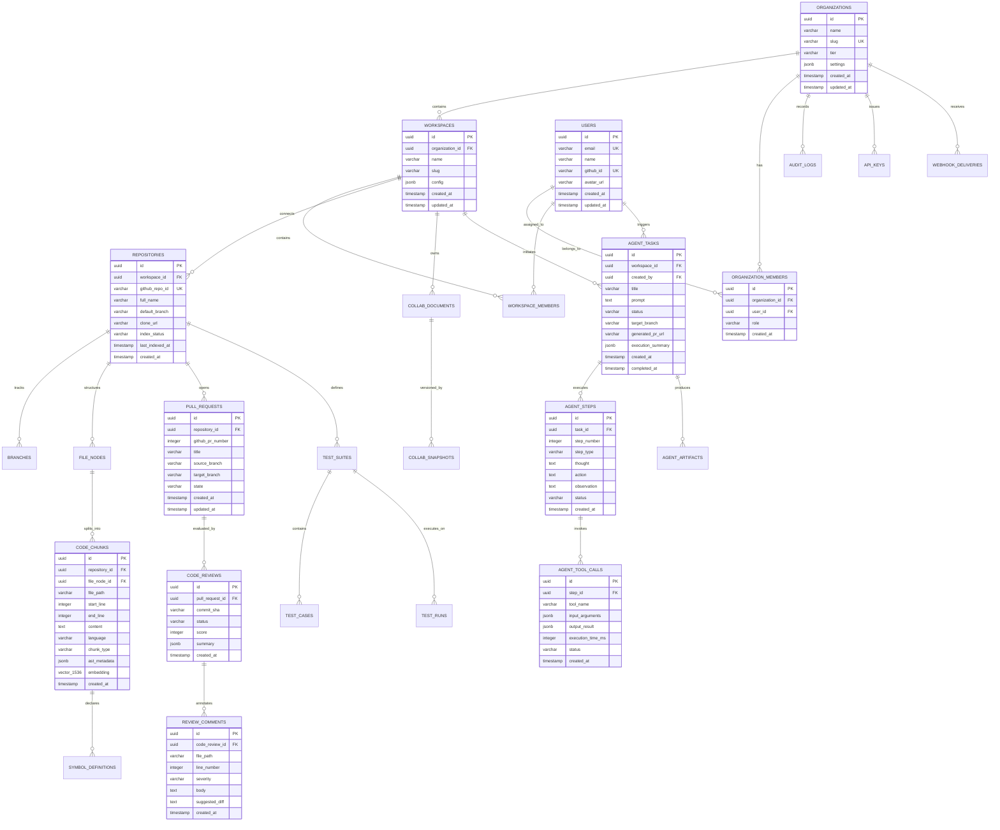
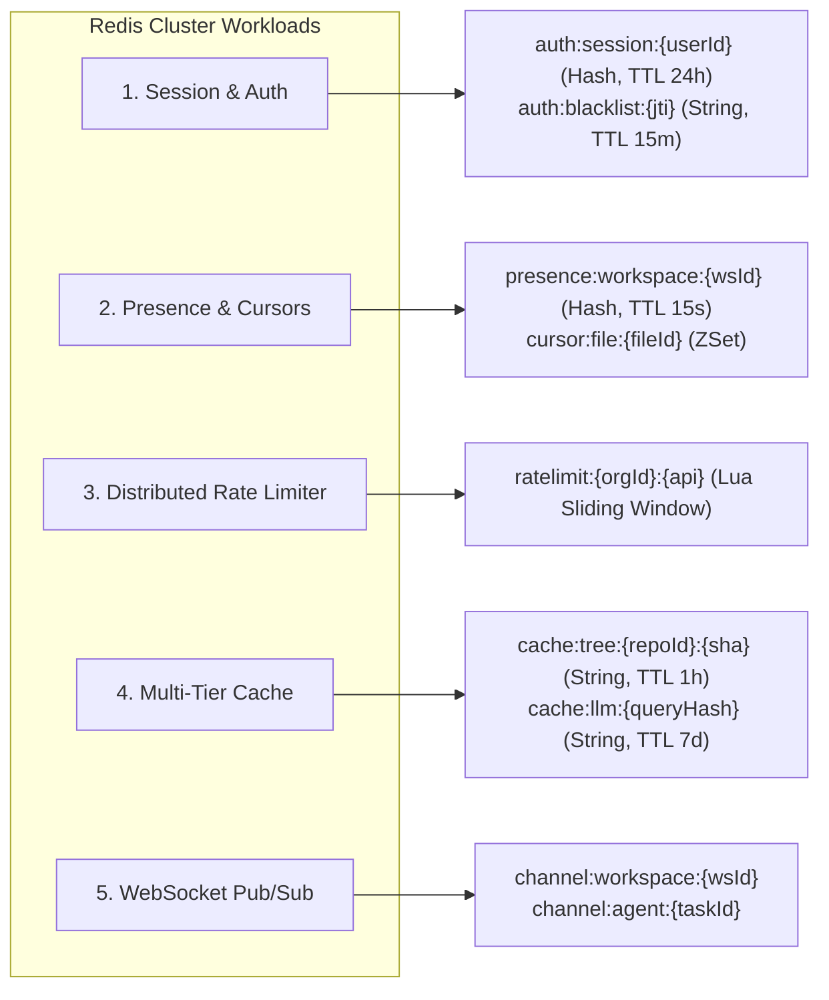

# DEVFLOW AI — Database Architecture & Storage Specification

> **System Name**: DEVFLOW AI  
> **Document Version**: 1.0.0  
> **Component**: Data Persistence Tier (PostgreSQL + pgvector & Redis Cluster)  
> **Author**: Senior Software Architect

---

## 1. Storage Architecture Overview

DEVFLOW AI implements a unified, highly scalable storage layer combining:

1. **Relational & Vector Store (PostgreSQL 16 + pgvector)**: Acts as the single source of truth (SSOT) for all relational business entities, access control, audit logs, AST symbol tables, and high-dimensional semantic vector embeddings.
2. **In-Memory Cache & Presence Engine (Redis 7.2 Cluster)**: Provides sub-millisecond data structures for user session revocation, real-time cursor/presence synchronization, distributed rate limiting, and WebSocket scale-out pub/sub.
3. **Connection Pooling Tier (PgBouncer)**: Sits between application compute nodes (NestJS & Python AI) and PostgreSQL to manage up to 5,000 active client connections with negligible memory overhead.

```mermaid
graph TD
    subgraph Compute Clients
        NestAPI1[NestJS Core API 1]
        NestAPI2[NestJS Core API 2]
        PythonAI1[Python AI Service 1]
        PythonAI2[Python AI Service 2]
    end

    subgraph Connection Pooling Layer
        PgBouncerPrimary[PgBouncer (Read/Write)]
        PgBouncerReplica[PgBouncer (Read-Only Pool)]
    end

    subgraph PostgreSQL 16 Multi-AZ Cluster
        PGPrimary[(PostgreSQL Primary - RW)]
        PGReplica1[(PostgreSQL Read Replica 1)]
        PGReplica2[(PostgreSQL Read Replica 2)]
    end

    subgraph Redis 7.2 Cluster (6 Nodes / 3 Shards)
        RedisM1[(Master Shard 1)] --- RedisR1[(Replica 1)]
        RedisM2[(Master Shard 2)] --- RedisR2[(Replica 2)]
        RedisM3[(Master Shard 3)] --- RedisR3[(Replica 3)]
    end

    NestAPI1 -->|Port 6432| PgBouncerPrimary
    NestAPI2 -->|Port 6432| PgBouncerPrimary
    NestAPI1 -->|Port 6433| PgBouncerReplica
    NestAPI2 -->|Port 6433| PgBouncerReplica

    PythonAI1 -->|AsyncPG / Vector Search| PgBouncerPrimary
    PythonAI2 -->|AsyncPG / Vector Search| PgBouncerReplica

    PgBouncerPrimary -->|Direct TCP| PGPrimary
    PgBouncerReplica -->|Direct TCP| PGReplica1
    PgBouncerReplica -->|Direct TCP| PGReplica2

    PGPrimary -.->|Streaming Replication (WAL)| PGReplica1
    PGPrimary -.->|Streaming Replication (WAL)| PGReplica2

    NestAPI1 <-->|RESP3 / Cluster Mode| RedisM1
    NestAPI2 <-->|RESP3 / Cluster Mode| RedisM2
    PythonAI1 <-->|RESP3 / Caching| RedisM3
```

---

## 2. PostgreSQL Entity-Relationship (ER) Diagram



---

## 3. Detailed Data Dictionary & Schema Definitions

### 3.1 Multi-Tenancy & Identity Tables

#### `organizations`

| Column       | Type           | Constraints                             | Description                                        |
| :----------- | :------------- | :-------------------------------------- | :------------------------------------------------- |
| `id`         | `UUID`         | `PRIMARY KEY DEFAULT gen_random_uuid()` | Unique organization identifier.                    |
| `name`       | `VARCHAR(255)` | `NOT NULL`                              | Display name of the organization.                  |
| `slug`       | `VARCHAR(100)` | `UNIQUE NOT NULL`                       | URL-safe unique identifier.                        |
| `tier`       | `VARCHAR(50)`  | `NOT NULL DEFAULT 'pro'`                | Subscription tier: `starter`, `pro`, `enterprise`. |
| `settings`   | `JSONB`        | `NOT NULL DEFAULT '{}'`                 | Security policies, LLM token quotas, SSO config.   |
| `created_at` | `TIMESTAMPTZ`  | `NOT NULL DEFAULT clock_timestamp()`    | Entity creation timestamp.                         |
| `updated_at` | `TIMESTAMPTZ`  | `NOT NULL DEFAULT clock_timestamp()`    | Last modification timestamp.                       |

#### `users`

| Column       | Type           | Constraints                             | Description               |
| :----------- | :------------- | :-------------------------------------- | :------------------------ |
| `id`         | `UUID`         | `PRIMARY KEY DEFAULT gen_random_uuid()` | Unique user identifier.   |
| `email`      | `VARCHAR(255)` | `UNIQUE NOT NULL`                       | Primary email address.    |
| `name`       | `VARCHAR(255)` | `NOT NULL`                              | Full display name.        |
| `github_id`  | `VARCHAR(100)` | `UNIQUE NOT NULL`                       | GitHub platform user ID.  |
| `avatar_url` | `TEXT`         | `NULL`                                  | Profile avatar image URL. |
| `created_at` | `TIMESTAMPTZ`  | `NOT NULL DEFAULT clock_timestamp()`    | Registration timestamp.   |
| `updated_at` | `TIMESTAMPTZ`  | `NOT NULL DEFAULT clock_timestamp()`    | Profile update timestamp. |

#### `organization_members`

| Column            | Type          | Constraints                                               | Description                                                 |
| :---------------- | :------------ | :-------------------------------------------------------- | :---------------------------------------------------------- |
| `id`              | `UUID`        | `PRIMARY KEY DEFAULT gen_random_uuid()`                   | Unique membership record ID.                                |
| `organization_id` | `UUID`        | `NOT NULL REFERENCES organizations(id) ON DELETE CASCADE` | Associated organization.                                    |
| `user_id`         | `UUID`        | `NOT NULL REFERENCES users(id) ON DELETE CASCADE`         | Associated user.                                            |
| `role`            | `VARCHAR(50)` | `NOT NULL DEFAULT 'developer'`                            | RBAC Role: `owner`, `admin`, `lead`, `developer`, `viewer`. |
| `created_at`      | `TIMESTAMPTZ` | `NOT NULL DEFAULT clock_timestamp()`                      | Timestamp user joined the organization.                     |

---

### 3.2 Repositories, AST Chunks & Vector Store

#### `repositories`

| Column            | Type           | Constraints                                            | Description                                   |
| :---------------- | :------------- | :----------------------------------------------------- | :-------------------------------------------- |
| `id`              | `UUID`         | `PRIMARY KEY DEFAULT gen_random_uuid()`                | Unique internal repository identifier.        |
| `workspace_id`    | `UUID`         | `NOT NULL REFERENCES workspaces(id) ON DELETE CASCADE` | Parent workspace.                             |
| `github_repo_id`  | `VARCHAR(100)` | `NOT NULL UNIQUE`                                      | GitHub repository integer/ID string.          |
| `full_name`       | `VARCHAR(255)` | `NOT NULL`                                             | Org/Repo slug (e.g. `devflow/core-api`).      |
| `default_branch`  | `VARCHAR(100)` | `NOT NULL DEFAULT 'main'`                              | Default git branch name.                      |
| `clone_url`       | `TEXT`         | `NOT NULL`                                             | Authenticated HTTPS clone URL.                |
| `index_status`    | `VARCHAR(50)`  | `NOT NULL DEFAULT 'pending'`                           | `pending`, `indexing`, `indexed`, `failed`.   |
| `last_indexed_at` | `TIMESTAMPTZ`  | `NULL`                                                 | Timestamp of last completed AST/vector index. |
| `created_at`      | `TIMESTAMPTZ`  | `NOT NULL DEFAULT clock_timestamp()`                   | Creation timestamp.                           |

#### `code_chunks` (Core RAG & Vector Table)

```sql
CREATE TABLE code_chunks (
    id UUID PRIMARY KEY DEFAULT gen_random_uuid(),
    repository_id UUID NOT NULL REFERENCES repositories(id) ON DELETE CASCADE,
    file_path VARCHAR(1024) NOT NULL,
    start_line INTEGER NOT NULL,
    end_line INTEGER NOT NULL,
    content TEXT NOT NULL,
    language VARCHAR(50) NOT NULL,
    chunk_type VARCHAR(50) NOT NULL, -- 'function', 'class', 'method', 'module'
    ast_metadata JSONB NOT NULL DEFAULT '{}', -- symbols, imports, decorators, calls
    embedding vector(1536) NOT NULL, -- OpenAI text-embedding-3-small or large
    created_at TIMESTAMPTZ NOT NULL DEFAULT clock_timestamp()
);

-- HNSW Vector Index for sub-40ms cosine similarity retrieval
CREATE INDEX idx_code_chunks_embedding ON code_chunks
USING hnsw (embedding vector_cosine_ops)
WITH (m = 16, ef_construction = 64);

-- Composite B-Tree index for tenant-scoped vector search
CREATE INDEX idx_code_chunks_repo_lang ON code_chunks(repository_id, language);

-- Trigram index for hybrid lexical/regex search
CREATE INDEX idx_code_chunks_content_trgm ON code_chunks USING gin (content gin_trgm_ops);
CREATE INDEX idx_code_chunks_ast_meta ON code_chunks USING gin (ast_metadata);
```

---

### 3.3 Autonomous Agent State & Tracing Tables

#### `agent_tasks`

| Column              | Type           | Constraints                                            | Description                                                                         |
| :------------------ | :------------- | :----------------------------------------------------- | :---------------------------------------------------------------------------------- |
| `id`                | `UUID`         | `PRIMARY KEY DEFAULT gen_random_uuid()`                | Unique agent execution task ID.                                                     |
| `workspace_id`      | `UUID`         | `NOT NULL REFERENCES workspaces(id) ON DELETE CASCADE` | Associated workspace.                                                               |
| `created_by`        | `UUID`         | `NOT NULL REFERENCES users(id)`                        | User who dispatched the task.                                                       |
| `title`             | `VARCHAR(255)` | `NOT NULL`                                             | Short descriptive title of the task.                                                |
| `prompt`            | `TEXT`         | `NOT NULL`                                             | Natural language instructions for the agent.                                        |
| `status`            | `VARCHAR(50)`  | `NOT NULL DEFAULT 'queued'`                            | `queued`, `planning`, `executing`, `verifying`, `completed`, `failed`, `cancelled`. |
| `target_branch`     | `VARCHAR(100)` | `NULL`                                                 | Git branch created by the agent.                                                    |
| `generated_pr_url`  | `TEXT`         | `NULL`                                                 | Link to published GitHub Pull Request.                                              |
| `execution_summary` | `JSONB`        | `NOT NULL DEFAULT '{}'`                                | Final stats (token count, total steps, tool runs).                                  |
| `created_at`        | `TIMESTAMPTZ`  | `NOT NULL DEFAULT clock_timestamp()`                   | Initialization timestamp.                                                           |
| `completed_at`      | `TIMESTAMPTZ`  | `NULL`                                                 | Task completion timestamp.                                                          |

#### `agent_steps`

| Column        | Type          | Constraints                                             | Description                                          |
| :------------ | :------------ | :------------------------------------------------------ | :--------------------------------------------------- |
| `id`          | `UUID`        | `PRIMARY KEY DEFAULT gen_random_uuid()`                 | Unique step execution ID.                            |
| `task_id`     | `UUID`        | `NOT NULL REFERENCES agent_tasks(id) ON DELETE CASCADE` | Parent agent task.                                   |
| `step_number` | `INTEGER`     | `NOT NULL`                                              | Monotonically increasing sequence step index.        |
| `step_type`   | `VARCHAR(50)` | `NOT NULL`                                              | `thought`, `tool_call`, `observation`, `reflection`. |
| `thought`     | `TEXT`        | `NULL`                                                  | Internal Chain-of-Thought reasoning.                 |
| `action`      | `TEXT`        | `NULL`                                                  | Action plan or proposed mutation.                    |
| `observation` | `TEXT`        | `NULL`                                                  | Output from environment/tool.                        |
| `status`      | `VARCHAR(50)` | `NOT NULL DEFAULT 'running'`                            | `running`, `success`, `failed`, `aborted`.           |
| `created_at`  | `TIMESTAMPTZ` | `NOT NULL DEFAULT clock_timestamp()`                    | Step start timestamp.                                |

#### `agent_tool_calls` (Partitioned by Range)

```sql
CREATE TABLE agent_tool_calls (
    id UUID DEFAULT gen_random_uuid(),
    step_id UUID NOT NULL,
    tool_name VARCHAR(100) NOT NULL, -- 'read_file', 'ast_grep', 'write_patch', 'run_tests'
    input_arguments JSONB NOT NULL,
    output_result JSONB NOT NULL,
    execution_time_ms INTEGER NOT NULL,
    status VARCHAR(50) NOT NULL,
    created_at TIMESTAMPTZ NOT NULL DEFAULT clock_timestamp(),
    PRIMARY KEY (id, created_at)
) PARTITION BY RANGE (created_at);

-- Monthly partitions
CREATE TABLE agent_tool_calls_2026_09 PARTITION OF agent_tool_calls
    FOR VALUES FROM ('2026-09-01 00:00:00+00') TO ('2026-10-01 00:00:00+00');
CREATE TABLE agent_tool_calls_2026_10 PARTITION OF agent_tool_calls
    FOR VALUES FROM ('2026-10-01 00:00:00+00') TO ('2026-11-01 00:00:00+00');
```

---

### 3.4 AI Code Review & Test Generation Tables

#### `pull_requests`

| Column             | Type           | Constraints                                              | Description                 |
| :----------------- | :------------- | :------------------------------------------------------- | :-------------------------- |
| `id`               | `UUID`         | `PRIMARY KEY DEFAULT gen_random_uuid()`                  | Unique PR record ID.        |
| `repository_id`    | `UUID`         | `NOT NULL REFERENCES repositories(id) ON DELETE CASCADE` | Associated repository.      |
| `github_pr_number` | `INTEGER`      | `NOT NULL`                                               | GitHub Pull Request number. |
| `title`            | `VARCHAR(500)` | `NOT NULL`                                               | PR title.                   |
| `source_branch`    | `VARCHAR(255)` | `NOT NULL`                                               | Head branch name.           |
| `target_branch`    | `VARCHAR(255)` | `NOT NULL`                                               | Base branch name.           |
| `state`            | `VARCHAR(50)`  | `NOT NULL DEFAULT 'open'`                                | `open`, `closed`, `merged`. |
| `created_at`       | `TIMESTAMPTZ`  | `NOT NULL DEFAULT clock_timestamp()`                     | Opened timestamp.           |
| `updated_at`       | `TIMESTAMPTZ`  | `NOT NULL DEFAULT clock_timestamp()`                     | Last updated.               |

#### `code_reviews`

| Column            | Type          | Constraints                                               | Description                                               |
| :---------------- | :------------ | :-------------------------------------------------------- | :-------------------------------------------------------- |
| `id`              | `UUID`        | `PRIMARY KEY DEFAULT gen_random_uuid()`                   | Unique review run ID.                                     |
| `pull_request_id` | `UUID`        | `NOT NULL REFERENCES pull_requests(id) ON DELETE CASCADE` | Target PR.                                                |
| `commit_sha`      | `VARCHAR(40)` | `NOT NULL`                                                | Head commit SHA analyzed.                                 |
| `status`          | `VARCHAR(50)` | `NOT NULL DEFAULT 'in_progress'`                          | `in_progress`, `approved`, `changes_requested`, `failed`. |
| `score`           | `INTEGER`     | `NOT NULL DEFAULT 100`                                    | Code health score (0-100).                                |
| `summary`         | `JSONB`       | `NOT NULL DEFAULT '{}'`                                   | High-level summary of findings and risk assessment.       |
| `created_at`      | `TIMESTAMPTZ` | `NOT NULL DEFAULT clock_timestamp()`                      | Analysis run timestamp.                                   |

#### `review_comments`

| Column           | Type            | Constraints                                              | Description                                |
| :--------------- | :-------------- | :------------------------------------------------------- | :----------------------------------------- |
| `id`             | `UUID`          | `PRIMARY KEY DEFAULT gen_random_uuid()`                  | Unique comment ID.                         |
| `code_review_id` | `UUID`          | `NOT NULL REFERENCES code_reviews(id) ON DELETE CASCADE` | Parent review.                             |
| `file_path`      | `VARCHAR(1024)` | `NOT NULL`                                               | Relative file path in repo.                |
| `line_number`    | `INTEGER`       | `NOT NULL`                                               | Target line number for annotation.         |
| `severity`       | `VARCHAR(50)`   | `NOT NULL`                                               | `info`, `warning`, `critical`, `security`. |
| `body`           | `TEXT`          | `NOT NULL`                                               | Explanation of issue with context.         |
| `suggested_diff` | `TEXT`          | `NULL`                                                   | Actionable GitHub diff replacement block.  |
| `created_at`     | `TIMESTAMPTZ`   | `NOT NULL DEFAULT clock_timestamp()`                     | Creation timestamp.                        |

---

## 4. Table Partitioning & Growth Management Strategy

To ensure zero performance degradation over years of operation, high-volume time-series tables are partitioned using PostgreSQL native range partitioning:

```mermaid
graph TD
    AuditMaster[audit_logs (Partitioned by created_at)]
    AuditMaster --> Audit202609[audit_logs_2026_09]
    AuditMaster --> Audit202610[audit_logs_2026_10]
    AuditMaster --> Audit202611[audit_logs_2026_11]

    ToolCallMaster[agent_tool_calls (Partitioned by created_at)]
    ToolCallMaster --> Tool202609[agent_tool_calls_2026_09]
    ToolCallMaster --> Tool202610[agent_tool_calls_2026_10]
    ToolCallMaster --> Tool202611[agent_tool_calls_2026_11]
```

- **Retention Policy**: Partition data older than 90 days is automatically exported to Amazon S3 in compressed Apache Parquet format via an automated background worker and dropped from PostgreSQL to conserve primary storage.

---

## 5. Redis Architecture & Key Schema Design



### 5.1 Redis Key Design Patterns & Data Structures

| Workload                 | Key Pattern                    | Data Structure       | TTL             | Description & Purpose                                                 |
| :----------------------- | :----------------------------- | :------------------- | :-------------- | :-------------------------------------------------------------------- |
| **Auth Session**         | `auth:session:{userId}`        | `Hash`               | `86400s` (24h)  | Stores active session metadata, roles, and device information.        |
| **Token Blacklist**      | `auth:blacklist:{jti}`         | `String`             | `900s` (15m)    | Revoked JWT identifiers checked on every authenticated request.       |
| **Workspace Presence**   | `presence:workspace:{wsId}`    | `Hash`               | `15s` (sliding) | Map of `userId -> { name, avatar, activeFile, lastHeartbeat }`.       |
| **Active Cursors**       | `cursor:file:{fileId}`         | `Hash`               | `10s` (sliding) | Map of `userId -> { line, column, selectionRange }`.                  |
| **Rate Limiter**         | `ratelimit:{orgId}:{endpoint}` | `ZSet` (Sorted Set)  | `60s`           | Sliding window log storing request timestamps for precise limits.     |
| **Repo File Tree Cache** | `cache:tree:{repoId}:{sha}`    | `String` (Gzip JSON) | `3600s` (1h)    | Pre-computed directory file hierarchy for instant IDE tree rendering. |
| **LLM Semantic Cache**   | `cache:llm:{sha256(prompt)}`   | `String` (JSON)      | `604800s` (7d)  | Exact-match LLM response cache to save duplicate inference costs.     |
| **Distributed Lock**     | `lock:repo:index:{repoId}`     | `String` (Redlock)   | `300s` (5m)     | Prevents concurrent index jobs on the same Git repository.            |
| **WebSocket Relay**      | `channel:workspace:{wsId}`     | `Pub/Sub Channel`    | N/A             | Broadcasts Yjs document updates and cursor changes across nodes.      |

### 5.2 Atomic Sliding Window Rate Limiting (Lua Script)

```lua
-- KEYS[1]: ratelimit:{orgId}:{endpoint}
-- ARGV[1]: current_timestamp_ms
-- ARGV[2]: window_size_ms (e.g. 60000)
-- ARGV[3]: max_limit (e.g. 100)
local key = KEYS[1]
local now = tonumber(ARGV[1])
local window = tonumber(ARGV[2])
local limit = tonumber(ARGV[3])
local clearBefore = now - window

-- Remove old timestamps outside the sliding window
redis.call('ZREMRANGEBYSCORE', key, 0, clearBefore)

-- Count current requests in window
local currentRequests = redis.call('ZCARD', key)

if currentRequests < limit then
    redis.call('ZADD', key, now, now)
    redis.call('PEXPIRE', key, window)
    return 1 -- Request Allowed
else
    return 0 -- Rate Limit Exceeded
end
```
