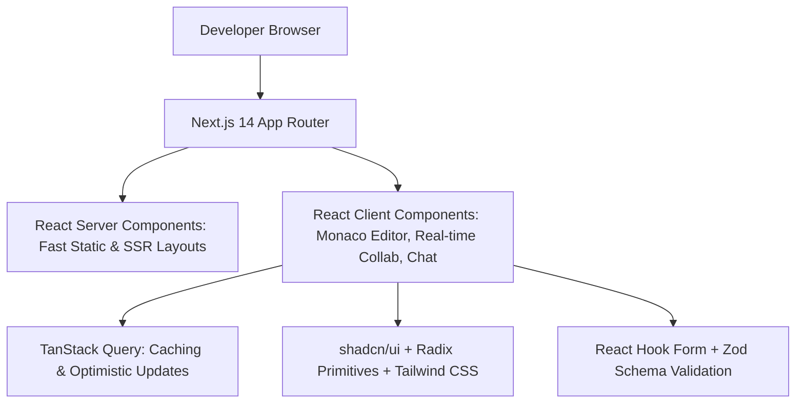
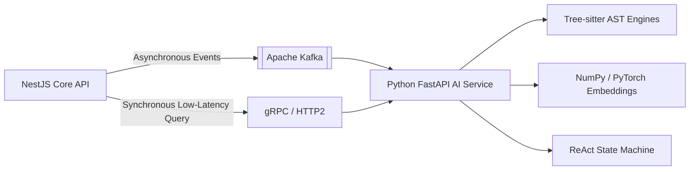
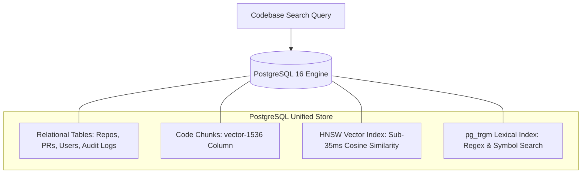
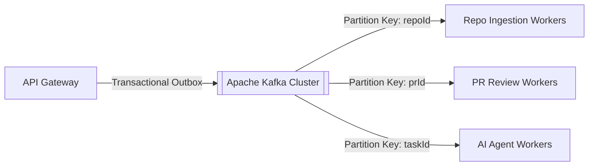
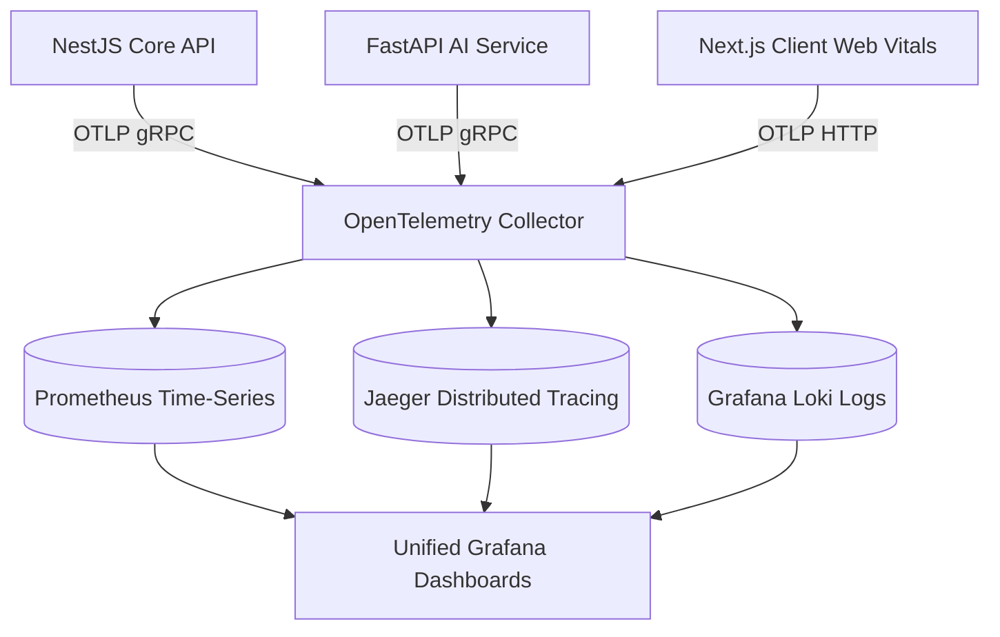

# DEVFLOW AI — Architecture Decision Records (ADRs)

> **System Name**: DEVFLOW AI  
> **Document Version**: 1.0.0  
> **Status**: Approved & Frozen for Implementation  
> **Author**: Senior Software Architect

---

## Index of Architecture Decision Records

- [ADR-001: Frontend Architecture (Next.js App Router, Tailwind, shadcn/ui)](#adr-001-frontend-architecture-nextjs-app-router-tailwind-shadcnui)
- [ADR-002: Modular Monolith in NestJS for Core Platform](#adr-002-modular-monolith-in-nestjs-for-core-platform)
- [ADR-003: Dedicated Python FastAPI Service for AI, RAG & Agents](#adr-003-dedicated-python-fastapi-service-for-ai-rag--agents)
- [ADR-004: PostgreSQL 16 + pgvector as Primary Relational & Vector Store](#adr-004-postgresql-16--pgvector-as-primary-relational--vector-store)
- [ADR-005: Redis Cluster for Sessions, Presence, Rate Limiting & Pub/Sub](#adr-005-redis-cluster-for-sessions-presence-rate-limiting--pubsub)
- [ADR-006: Apache Kafka for Asynchronous Event Streaming & Job Queues](#adr-006-apache-kafka-for-asynchronous-event-streaming--job-queues)
- [ADR-007: gVisor User-Space Sandboxing for Untrusted Code Execution](#adr-007-gvisor-user-space-sandboxing-for-untrusted-code-execution)
- [ADR-008: OpenTelemetry, Prometheus & Grafana for Unified Observability](#adr-008-opentelemetry-prometheus--grafana-for-unified-observability)
- [ADR-009: Turborepo Monorepo with Shared TypeScript & Contract Packages](#adr-009-turborepo-monorepo-with-shared-typescript--contract-packages)
- [ADR-010: Yjs CRDT & Socket.IO for Real-Time Multiplayer Collaboration](#adr-010-yjs-crdt--socketio-for-real-time-multiplayer-collaboration)

---

## ADR-001: Frontend Architecture (Next.js App Router, Tailwind, shadcn/ui)

### Status: Approved

### Context

DEVFLOW AI requires a responsive, high-performance web cockpit featuring rich real-time collaborative code editing, interactive AI chat streaming, and dynamic GitHub PR diff reviews.

### Decision

Adopt **Next.js 14 (App Router)** with **React**, **TypeScript**, **Tailwind CSS**, **shadcn/ui**, **TanStack Query v5**, **Zod**, and **React Hook Form**.



### Why Required & Problem Solved

- **SSR & Hydration Performance**: Next.js React Server Components (RSC) allow instant initial loading of large repo structures while streaming dynamic client components.
- **Component Design System**: `shadcn/ui` provides accessible, customizable Radix primitives without lock-in to heavyweight component libraries.
- **Type Safety & Data Fetching**: TanStack Query combined with Zod guarantees end-to-end type safety from API responses to UI state.

### Alternatives Considered

- **Vite + React SPA**: Fast client-side bundling, but lacks built-in server-side rendering, SEO metadata, and unified API proxy capabilities.
- **Remix**: Excellent nested routing and form actions, but smaller component ecosystem and less mature enterprise UI library integration compared to Next.js/shadcn.
- **Vue / Nuxt**: Clean reactivity, but lacks TypeScript ecosystem depth for deep monorepo AST and Monaco editor integration.

### Trade-offs

- **Pros**: Superior developer velocity, unified TypeScript types across frontend and backend, instant UI responsiveness.
- **Cons**: Next.js App Router has a steeper learning curve regarding server vs. client boundary separation (`'use client'`).

---

## ADR-002: Modular Monolith in NestJS for Core Platform

### Status: Approved

### Context

The platform backend needs to manage identity, multi-tenancy, workspace state, GitHub webhooks, collaborative sessions, and audit logging with strict transactional integrity.

### Decision

Implement the core backend as a **Modular Monolith in NestJS (Node.js/TypeScript)** with strictly defined module boundaries and dependency injection.

```mermaid
graph TD
    subgraph Modular Monolith (apps/api)
        Core[NestJS Core Engine]
        AuthMod[AuthModule]
        OrgMod[OrganizationModule]
        RepoMod[RepositoryModule]
        CollabMod[CollaborationModule]
        AuditMod[AuditModule]
    end

    Core --> AuthMod
    Core --> OrgMod
    Core --> RepoMod
    Core --> CollabMod
    Core --> AuditMod

    CollabMod -.->|Event Contract| KafkaBus[[Kafka Event Bus]]
    RepoMod -.->|Event Contract| KafkaBus
```

### Architectural Principle Alignment

- **No Premature Microservices**: Avoids network latency, distributed transaction complexity (2PC/Sagas), and deployment overhead during initial platform maturity.
- **Evolutionary Architecture**: Modules are strictly decoupled using Domain-Driven Design (DDD) bounded contexts and event-driven interfaces, allowing any single module to be extracted into a microservice in the future if required.

### Why Required & Problem Solved

- **Enterprise Architecture**: NestJS enforces Angular-inspired architectural patterns (Modules, Controllers, Providers, Guards, Interceptors, Pipes).
- **TypeScript Monorepo Synergy**: Shares 100% of DTOs, Zod schemas, and data interfaces with the Next.js frontend and Turborepo packages.

### Alternatives Considered

- **Microservices from Day 1**: High operational burden, RPC latency overhead, complex local developer setup.
- **Pure Express/Fastify**: Too unopinionated; often leads to spaghetti code in large teams without strict architecture enforcement.
- **Go / Gin**: Highly performant, but prevents sharing TypeScript types and models with the web frontend.

### Trade-offs

- **Pros**: Rapid feature delivery, single deployment pipeline, zero RPC network latency between core modules, clean refactoring.
- **Cons**: All platform modules deploy together in the core API container (mitigated by automated CI/CD and multi-instance Fargate auto-scaling).

---

## ADR-003: Dedicated Python FastAPI Service for AI, RAG & Agents

### Status: Approved

### Context

AI operations (AST parsing with Tree-sitter, vector embeddings, hybrid dense-sparse retrieval, ReAct agent state machines, and test generation) require specialized libraries, async streaming, and heavy numeric processing.

### Decision

Deploy a decoupled **Python 3.11 FastAPI microservice** (`apps/ai-service`) communicating with the NestJS core platform asynchronously via Kafka and synchronously via gRPC/REST.



### Why Required & Problem Solved

- **Native AI Ecosystem**: Python is the uncontested standard for AST analysis (Tree-sitter), vector mathematics (NumPy, SciPy), and agent frameworks.
- **AsyncIO Concurrency**: FastAPI provides non-blocking async endpoints ideal for long-running LLM token streaming and multi-step tool loops.
- **Separation of Compute Concerns**: Isolates heavy memory and CPU spikes (AST parsing of 100k LoC repositories) away from the primary user-facing NestJS web gateway.

### Alternatives Considered

- **Pure Node.js LangChain**: JavaScript LLM libraries lag behind Python in feature parity, Tree-sitter bindings are less mature, and vector math is significantly slower.
- **All-in-One Python Monolith**: Python is suboptimal for high-concurrency WebSocket multiplayer CRDT synchronization compared to Node.js / TypeScript.

### Trade-offs

- **Pros**: Best-in-class AI tooling, independent scaling of compute-heavy AI workers on GPU/high-CPU instances.
- **Cons**: Requires maintaining two runtime stacks (TypeScript and Python) in the monorepo.

---

## ADR-004: PostgreSQL 16 + pgvector as Primary Relational & Vector Store

### Status: Approved

### Context

DEVFLOW AI stores relational metadata (organizations, users, pull requests, audit logs) alongside millions of high-dimensional vector embeddings for source code chunks.

### Decision

Use **PostgreSQL 16 with the `pgvector` extension (HNSW indexing)** as the unified database for both relational entities and vector search.



### Why Required & Problem Solved

- **ACID Consistency & Atomic Transactions**: Eliminates the dual-database split-brain problem where a relational database and a standalone vector database fall out of sync upon repository deletion or re-indexing.
- **Tenant-Filtered Vector Queries**: Allows querying vector similarity with relational SQL filters in a single atomic query (e.g., `WHERE repository_id = '...' AND language = 'typescript' ORDER BY embedding <=> $1 LIMIT 20`).
- **HNSW Sub-35ms Performance**: `pgvector` 0.5+ provides Hierarchical Navigable Small World (HNSW) indexing comparable in speed and recall to dedicated vector engines.

### Alternatives Considered

- **Dedicated Vector DB (Pinecone, Qdrant, Milvus) + Separate Postgres**: Introduces distributed consistency nightmares, doubled operational maintenance, and high recurring SaaS costs ($1,000+/mo for Pinecone).
- **MongoDB + Atlas Vector**: Lacks relational integrity, foreign keys, and advanced transactional isolation required for enterprise multi-tenancy.

### Trade-offs

- **Pros**: Single database to backup, monitor, and scale; zero sync drift; enterprise Multi-AZ RDS support.
- **Cons**: Requires adequate RAM sizing (RDS memory buffers) to keep HNSW indexes resident in memory.

---

## ADR-005: Redis Cluster for Sessions, Presence, Rate Limiting & Pub/Sub

### Status: Approved

### Context

Multiplayer collaborative editing, API protection, and fast auth checks demand microsecond-latency data structures.

### Decision

Deploy **Redis 7.2 Cluster** (3 Master / 3 Replica shards) as the centralized in-memory caching and transient state layer.

### Why Required & Problem Solved

- **Sub-Millisecond Presence**: Tracks live user cursors, active files, and workspace member heartbeats with sliding TTLs.
- **Distributed Atomic Rate Limiting**: Redis Lua scripts execute atomic sliding-window log calculations, preventing API abuse across load-balanced gateway nodes.
- **WebSocket Pub/Sub Scale-Out**: Relays Yjs document deltas and live AI token streams across multi-instance NestJS nodes.

### Alternatives Considered

- **Memcached**: Lacks advanced data structures (Hashes, Sorted Sets, Streams), Pub/Sub, and persistence.
- **DynamoDB**: Higher latency (~10-20ms vs. < 1ms), higher cost for high-frequency presence polling (5s heartbeats).

### Trade-offs

- **Pros**: Extreme throughput (> 100k ops/sec), versatile multi-workload capabilities.
- **Cons**: Volatile memory requires careful eviction policy (`volatile-lru`) to avoid exhausting memory.

---

## ADR-006: Apache Kafka for Asynchronous Event Streaming & Job Queues

### Status: Approved

### Context

Heavy operations (repository cloning, AST indexing, PR review diff analysis, agent step execution, and audit logging) must not block synchronous HTTP requests.

### Decision

Use **Apache Kafka (KRaft mode / Amazon MSK)** as the enterprise distributed event streaming platform.



### Why Required & Problem Solved

- **Strict Per-Key Ordering**: Ensures commits and AST updates for a specific repository or agent task are processed strictly in chronological order.
- **Replayability & Event Sourcing**: Allows re-indexing or replaying failed workflows from any historical offset.
- **High-Throughput Backpressure**: Handles bursty webhook spikes (e.g. 500 simultaneous push events across enterprise orgs) without dropping payloads.

### Alternatives Considered

- **RabbitMQ**: Excellent for simple message routing, but lacks high-throughput event replayability and multi-consumer topic streaming at scale.
- **AWS SQS/SNS**: Managed and simple, but lacks strict partition-keyed ordering across high-volume streams and has higher latency.
- **BullMQ (Redis Queues)**: Good for basic job queues, but not suitable as an enterprise event bus with durable long-term retention and high concurrency.

### Trade-offs

- **Pros**: Industry standard for enterprise event-driven systems, bulletproof durability, horizontal consumer scaling.
- **Cons**: Higher operational complexity than Redis queues (mitigated by AWS MSK managed service and KRaft mode eliminating ZooKeeper).

---

## ADR-007: gVisor User-Space Sandboxing for Untrusted Code Execution

### Status: Approved

### Context

AI agents generate and execute arbitrary code, install package dependencies, and run test suites. Running untrusted code on raw host operating systems creates severe remote code execution (RCE) and container breakout risks.

### Decision

Isolate all code execution, test runs, and linter executions inside **ephemeral gVisor (`runsc`) sandboxed containers**.

```mermaid
graph TD
    AgentCmd[Agent Run: 'pytest' / 'npm test'] --> Dispatcher[Sandbox Manager]
    Dispatcher --> gVisor[gVisor runsc Sandbox]

    subgraph Sandbox Security Barrier
        gVisor --> Sentry[Sentry User-Space Kernel: Intercepts Syscalls]
        gVisor --> Gofer[Gofer File Proxy: Restricts FS Access]
        gVisor --> NetJail[Network: Loopback Only / No Outbound Egress]
    end

    gVisor --> HostKernel[Host Linux Kernel (Protected from Direct Exploits)]
```

### Why Required & Problem Solved

- **Kernel Attack Surface Reduction**: gVisor intercepts and implements Linux system calls in a user-space kernel (Sentry), preventing direct host kernel exploitation.
- **Strict Resource Boundaries**: Enforces hard limits (1 CPU, 1024MB RAM, 60s timeout, read-only root FS, zero network egress).
- **Multi-Tenant Protection**: Prevents malicious code from accessing adjacent tenant memory or the host filesystem.

### Alternatives Considered

- **Standard Docker (`runc`)**: Shares the host Linux kernel directly; vulnerable to kernel privilege escalation and container breakout CVEs.
- **AWS Lambda**: Good isolation, but high cold-start latency (> 2s), limited filesystem control, and complex local development parity.
- **WebAssembly (WASI)**: Lightweight, but cannot execute full arbitrary language runtimes (Node.js + Python + Go + Rust native test runners).

### Trade-offs

- **Pros**: Production-grade virtualization security with container-like fast startup times (< 500ms).
- **Cons**: Slight CPU overhead (~10-15% slower syscalls than raw bare metal), which is completely acceptable for test runs.

---

## ADR-008: OpenTelemetry, Prometheus & Grafana for Unified Observability

### Status: Approved

### Context

Troubleshooting distributed interactions between Next.js, NestJS, Python FastAPI, Kafka, PostgreSQL, and LLMs requires unified tracing, metrics, and structured logging.

### Decision

Adopt the **OpenTelemetry (OTel)** open standard across all services, exporting to **Prometheus** (metrics), **Jaeger/Tempo** (traces), and **Grafana** (dashboards).



### Why Required & Problem Solved

- **Vendor-Agnostic Standard**: Eliminates proprietary agent lock-in (e.g. Datadog / New Relic).
- **End-to-End Distributed Context**: Propagates `traceparent` headers across HTTP requests, Kafka event messages, and background worker threads.
- **AI & LLM Metric Tracking**: Instruments LLM latency, token usage, cache hit ratios, and tool execution durations alongside standard HTTP metrics.

### Alternatives Considered

- **Datadog / New Relic SaaS**: Extremely expensive at scale ($20,000+/year for enterprise telemetry).
- **AWS CloudWatch**: Fragmented developer experience, high query latency, and poor correlation between traces and metrics.

### Trade-offs

- **Pros**: Complete data sovereignty, zero licensing costs, unified open standard.
- **Cons**: Requires hosting and managing Prometheus and Grafana infrastructure (supported via standard Helm charts / AWS managed Grafana).

---

## ADR-009: Turborepo Monorepo with Shared TypeScript & Contract Packages

### Status: Approved

### Context

Maintaining shared TypeScript types, database entities, validation schemas, and UI components across multiple applications (`web`, `api`, `ai-service`) in separate repositories leads to schema drift and integration bugs.

### Decision

Organize the codebase as a **Turborepo Monorepo** managed with `pnpm workspaces`.

### Why Required & Problem Solved

- **Single Source of Truth**: Shared contracts (`packages/types`), database models (`packages/database`), and UI primitives (`packages/ui`) are imported directly without duplicate declarations.
- **Intelligent Build Caching**: Turbo caches task outputs based on file hash graphs, cutting CI build times by over 70%.
- **Atomic Cross-Service Changes**: Allows updating an API endpoint DTO, frontend consumer, and database migration in a single atomic Git commit.

### Alternatives Considered

- **Polyrepo**: Severe version skew, constant publishing of private NPM packages, fragmented PRs.
- **Nx**: Powerful, but significantly heavier configuration overhead compared to Turborepo's lightweight pipeline.

### Trade-offs

- **Pros**: Incredible developer velocity, instant type checking across boundaries.
- **Cons**: Monorepo size grows over time (managed via Git LFS and selective sparse checkouts).

---

## ADR-010: Yjs CRDT & Socket.IO for Real-Time Multiplayer Collaboration

### Status: Approved

### Context

The platform requires collaborative multi-user code editing with concurrent conflict resolution, active cursor broadcasting, and sub-30ms responsiveness.

### Decision

Implement real-time collaboration using **Yjs Conflict-free Replicated Data Types (CRDTs)** over **Socket.IO WebSockets**, backed by Redis for multi-node distribution.

```mermaid
graph TD
    Client1[Dev A Editor] <-->|Yjs Binary Updates| SocketServer[NestJS WebSocket Gateway]
    Client2[Dev B Editor] <-->|Yjs Binary Updates| SocketServer

    SocketServer <--> YjsDoc[Yjs Shared Document CRDT]
    SocketServer <--> RedisPubSub[(Redis Pub/Sub Adapter)]
    YjsDoc -.->|Periodic Snapshot (60s)| PGStore[(PostgreSQL Snapshot Store)]
```

### Why Required & Problem Solved

- **Deterministic Conflict Resolution**: Yjs CRDT mathematically guarantees eventual consistency across all concurrent typers without requiring a centralized lock manager.
- **Network Partition Resilient**: Users can edit offline or during transient network drops; changes merge cleanly upon reconnection.
- **High Efficiency**: Yjs binary encoding compresses document state updates into minimal byte payloads (< 100 bytes per keystroke).

### Alternatives Considered

- **Operational Transformation (OT) / ShareDB**: Requires complex centralized transformation servers; prone to desynchronization bugs under high concurrency.
- **Liveblocks / SaaS Collab Platforms**: Adds third-party latency and recurring per-user monthly SaaS fees.

### Trade-offs

- **Pros**: Pure open-source, industry standard used by Monaco/VSCode collaborative plugins, zero merge conflicts.
- **Cons**: CRDT state memory grows over extensive editing sessions (mitigated by periodic state compaction snapshots).
