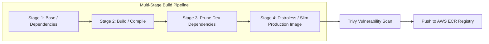
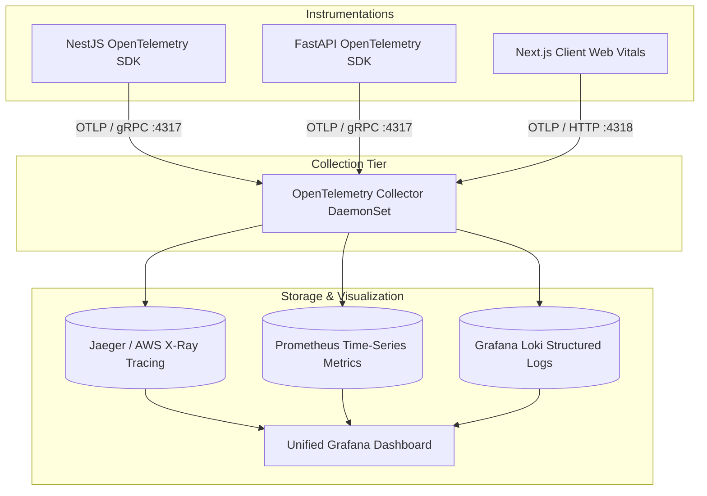

# DEVFLOW AI — Deployment, Infrastructure & CI/CD Specification

> **System Name**: DEVFLOW AI  
> **Document Version**: 1.0.0  
> **Component**: Cloud Infrastructure (AWS), Containerization (Docker), CI/CD (GitHub Actions), Observability (OpenTelemetry)  
> **Author**: Senior Software Architect

---

## 1. Cloud Deployment Architecture (AWS Production Blueprint)

DEVFLOW AI is deployed on **Amazon Web Services (AWS)** using a Multi-AZ, zero-trust VPC architecture designed for 99.95% availability, seamless auto-scaling, and strict network isolation.

```mermaid
graph TD
    subgraph Internet & Edge Tier
        DNS[Amazon Route 53] --> WAF[AWS WAF / Cloudflare]
        WAF --> ALB[AWS Application Load Balancer]
    end

    subgraph AWS VPC (10.0.0.0/16 - Multi-AZ)
        subgraph Public Subnets (10.0.1.0/24, 10.0.2.0/24, 10.0.3.0/24)
            NAT1[NAT Gateway AZ-1]
            NAT2[NAT Gateway AZ-2]
            NAT3[NAT Gateway AZ-3]
        end

        subgraph Private Compute Subnets (10.0.10.0/24, 10.0.20.0/24, 10.0.30.0/24)
            ECS_Web[Next.js Web Frontend: ECS Fargate]
            ECS_API[NestJS Core API: ECS Fargate]
            ECS_AI[Python AI Service: ECS Fargate / EC2 G5 GPU]
            SandboxPool[Ephemeral Execution Pool: gVisor on EC2]
        end

        subgraph Private Data Subnets (10.0.100.0/24, 10.0.200.0/24, 10.0.300.0/24)
            RDS_PG[(Amazon RDS PostgreSQL 16 + pgvector Multi-AZ)]
            Redis_Cluster[(Amazon ElastiCache Redis 7.2 Cluster)]
            MSK_Kafka[[Amazon MSK Managed Kafka 3.6]]
        end
    end

    subgraph Observability & Storage
        S3_Artifacts[(Amazon S3: Code & Audit Archives)]
        OTelCollector[OpenTelemetry Collector]
        Prometheus[Prometheus Metrics]
        Grafana[Grafana Dashboards]
    end

    ALB -->|HTTPS :443| ECS_Web
    ALB -->|HTTPS :443 / WSS| ECS_API

    ECS_Web --> ECS_API
    ECS_API --> RDS_PG
    ECS_API --> Redis_Cluster
    ECS_API --> MSK_Kafka

    MSK_Kafka --> ECS_AI
    ECS_AI --> RDS_PG
    ECS_AI --> Redis_Cluster
    ECS_AI --> SandboxPool

    ECS_API --> OTelCollector
    ECS_AI --> OTelCollector
    OTelCollector --> Prometheus
    Prometheus --> Grafana
    ECS_API --> S3_Artifacts
```

---

## 2. Docker Architecture & Multi-Stage Builds

All container images are engineered for minimal attack surface, rapid boot time (< 3s), and zero vulnerability footprint using **distroless and alpine-based multi-stage Dockerfiles**.



### 2.1 Multi-Stage Dockerfile Specifications

#### Next.js Web Frontend (`apps/web/Dockerfile`)

```dockerfile
# Stage 1: Base
FROM node:20-alpine AS base
WORKDIR /app
RUN apk add --no-cache libc6-compat
ENV PNPM_HOME="/pnpm"
ENV PATH="$PNPM_HOME:$PATH"
RUN corepack enable

# Stage 2: Dependencies
FROM base AS deps
WORKDIR /app
COPY package.json pnpm-lock.yaml pnpm-workspace.yaml ./
COPY apps/web/package.json ./apps/web/
COPY packages/ ./packages/
RUN pnpm install --frozen-lockfile

# Stage 3: Builder
FROM base AS builder
WORKDIR /app
COPY --from=deps /app/node_modules ./node_modules
COPY --from=deps /app/packages ./packages
COPY . .
ENV NEXT_TELEMETRY_DISABLED=1
ENV NODE_ENV=production
RUN pnpm --filter @devflow/web build

# Stage 4: Runner
FROM gcr.io/distroless/nodejs20-debian12 AS runner
WORKDIR /app
ENV NODE_ENV=production
ENV PORT=3000
COPY --from=builder /app/apps/web/public ./apps/web/public
COPY --from=builder /app/apps/web/.next/standalone ./
COPY --from=builder /app/apps/web/.next/static ./apps/web/.next/static

USER 10001
EXPOSE 3000
CMD ["apps/web/server.js"]
```

#### Python AI Engine (`apps/ai-service/Dockerfile`)

```dockerfile
# Stage 1: Builder
FROM python:3.11-slim AS builder
WORKDIR /app
RUN apt-get update && apt-get install -y --no-install-recommends \
    build-essential git curl && rm -rf /var/lib/apt/lists/*
COPY requirements.txt .
RUN pip install --no-cache-dir --user -r requirements.txt

# Stage 2: Runner
FROM python:3.11-slim AS runner
WORKDIR /app
RUN apt-get update && apt-get install -y --no-install-recommends \
    git libgomp1 && rm -rf /var/lib/apt/lists/*
COPY --from=builder /root/.local /root/.local
ENV PATH=/root/.local/bin:$PATH
COPY . .

# Run as non-root
RUN useradd -u 10001 devflow && chown -R devflow:devflow /app
USER devflow
EXPOSE 8000
CMD ["uvicorn", "app.main:app", "--host", "0.0.0.0", "--port", "8000", "--workers", "4"]
```

---

## 3. Local Development Orchestration (`docker-compose.yml`)

The local development stack spins up all dependencies with a single command:

```yaml
version: '3.8'

services:
  postgres:
    image: pgvector/pgvector:pg16
    container_name: devflow-postgres
    restart: always
    environment:
      POSTGRES_USER: devflow
      POSTGRES_PASSWORD: devflow_password
      POSTGRES_DB: devflow_db
    ports:
      - '5432:5432'
    volumes:
      - pgdata:/var/lib/postgresql/data
      - ./infra/docker/init-pgvector.sql:/docker-entrypoint-initdb.d/init.sql
    healthcheck:
      test: ['CMD-SHELL', 'pg_isready -U devflow -d devflow_db']
      interval: 5s
      timeout: 5s
      retries: 5

  redis:
    image: redis:7.2-alpine
    container_name: devflow-redis
    restart: always
    ports:
      - '6379:6379'
    command: redis-server --appendonly yes --requirepass redis_password
    volumes:
      - redisdata:/data
    healthcheck:
      test: ['CMD', 'redis-cli', '-a', 'redis_password', 'ping']
      interval: 5s
      timeout: 3s
      retries: 5

  kafka:
    image: bitnami/kafka:3.6
    container_name: devflow-kafka
    restart: always
    ports:
      - '9092:9092'
      - '9094:9094'
    environment:
      - KAFKA_CFG_NODE_ID=1
      - KAFKA_CFG_PROCESS_ROLES=controller,broker
      - KAFKA_CFG_CONTROLLER_QUORUM_VOTERS=1@kafka:9093
      - KAFKA_CFG_LISTENERS=PLAINTEXT://:9092,CONTROLLER://:9093,EXTERNAL://:9094
      - KAFKA_CFG_ADVERTISED_LISTENERS=PLAINTEXT://kafka:9092,EXTERNAL://localhost:9094
      - KAFKA_CFG_LISTENER_SECURITY_PROTOCOL_MAP=CONTROLLER:PLAINTEXT,PLAINTEXT:PLAINTEXT,EXTERNAL:PLAINTEXT
      - KAFKA_CFG_CONTROLLER_LISTENER_NAMES=CONTROLLER
      - KAFKA_CFG_INTER_BROKER_LISTENER_NAME=PLAINTEXT
    volumes:
      - kafkadata:/bitnami/kafka

  otel-collector:
    image: otel/opentelemetry-collector-contrib:0.95.0
    container_name: devflow-otel-collector
    ports:
      - '4317:4317' # OTLP gRPC
      - '4318:4318' # OTLP HTTP
      - '8889:8889' # Prometheus metrics export
    volumes:
      - ./infra/monitoring/otel-collector-config.yaml:/etc/otelcol-contrib/config.yaml

volumes:
  pgdata:
  redisdata:
  kafkadata:
```

---

## 4. Continuous Integration & Continuous Deployment (CI/CD) Pipeline

DEVFLOW AI uses an enterprise **GitHub Actions CI/CD Pipeline** with strict automated gates before staging and production deployments.

```mermaid
flowchart TD
    Push[Git Push / PR Created] --> LintTest[Stage 1: Lint, Format, Typecheck]
    LintTest --> UnitTests[Stage 2: Unit & Integration Tests (Testcontainers)]

    UnitTests --> SecurityScan[Stage 3: Security Scan (Trivy + Snyk + Gitleaks)]
    SecurityScan --> AI_Eval[Stage 4: AI Evaluation (Ragas Ground-Truth Benchmark)]

    AI_Eval --> DockerBuild[Stage 5: Docker Build & Push to Amazon ECR]
    DockerBuild --> DeployStaging[Stage 6: Deploy to Staging (ECS Fargate)]

    DeployStaging --> E2ETests[Stage 7: Playwright E2E Test Suite]
    E2ETests --> CanaryProd[Stage 8: Canary Production Deployment (10% -> 50% -> 100%)]

    CanaryProd --> HealthCheck{Verify Canary Health & Error Rates}
    HealthCheck -->|No Errors| FullRollout[Full Production Rollout Completed]
    HealthCheck -->|Error Rate > 0.1%| AutoRollback[Automated Rollback to Previous Release]
```

### 4.1 CI Workflow Specification (`.github/workflows/ci.yml`)

1. **Parallel Execution**: Frontend, Backend, and AI Service tests run in parallel matrix jobs.
2. **Caching Strategy**: Turbo cache, pnpm store, and Docker layer caches (`type=gha`) reduce CI duration from 18m to < 3.5m.
3. **Automated Rollback Gate**: If HTTP 5xx error rate exceeds 0.1% or latency increases by > 20% within 10 minutes of canary release, AWS CodeDeploy triggers an instantaneous rollback.

---

## 5. Observability & Distributed Tracing Architecture

DEVFLOW AI adopts the **OpenTelemetry (OTel)** standard across TypeScript and Python runtimes to ensure 100% end-to-end visibility.



### 5.1 Key Service Level Objectives (SLOs) & Alert Rules

| Metric / Objective          | Target SLA | Alert Threshold        | Action / Escalation               |
| :-------------------------- | :--------- | :--------------------- | :-------------------------------- |
| **API Availability**        | 99.95%     | Uptime < 99.9% over 5m | PagerDuty High-Severity Alert     |
| **API p95 Latency**         | < 120ms    | p95 > 250ms over 3m    | Automated Auto-Scaling Trigger    |
| **LLM Time-to-First-Token** | < 800ms    | TTFT > 1800ms over 5m  | Switch to Secondary Fallback LLM  |
| **Kafka Consumer Lag**      | < 50 msgs  | Lag > 500 msgs for 2m  | Auto-scale Consumer Worker Pods   |
| **Dead Letter Queue (DLQ)** | 0 msgs     | Depth > 5 msgs         | Slack `#alerts-devflow-dlq` Alert |
| **Vector Search Latency**   | < 35ms     | p95 > 80ms over 5m     | Trigger HNSW Index Maintenance    |
