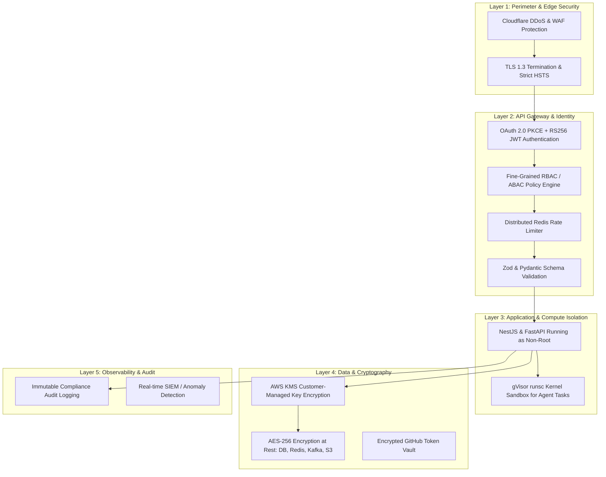
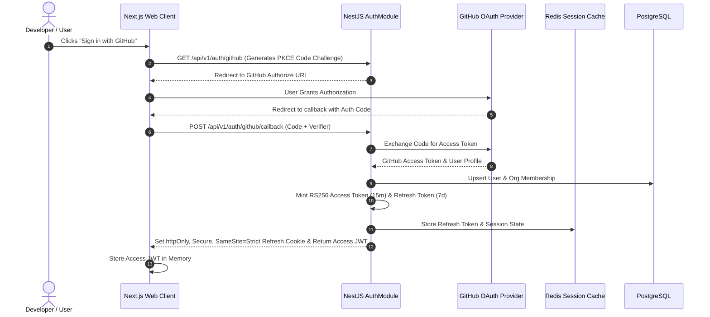
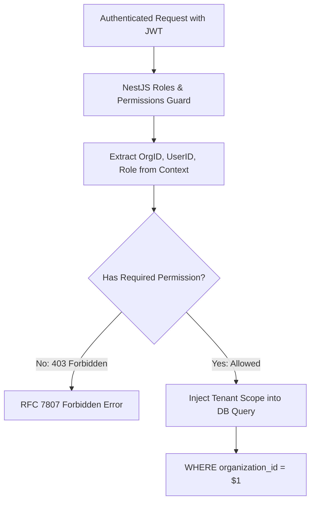

# DEVFLOW AI — Security Architecture & Threat Model Specification

> **System Name**: DEVFLOW AI  
> **Document Version**: 1.0.0  
> **Component**: Enterprise Security, Zero-Trust Architecture, Sandboxing & Compliance  
> **Author**: Senior Software Architect

---

## 1. Security Philosophy & Defense-in-Depth

DEVFLOW AI operates on a **Zero-Trust Security Architecture**. Because the platform processes sensitive proprietary source code, runs untrusted code generated by AI agents, and integrates directly with corporate GitHub organizations, security is embedded into every architectural layer.



---

## 2. Authentication & Session Lifecycle



### 2.1 Token Security Specifications

- **Access Tokens**: Short-lived JWTs (15-minute TTL) signed using asymmetric **RS256** (RSA 4096-bit private key rotated every 90 days). Verified using public key caching.
- **Refresh Tokens**: Opaque cryptographically random 256-bit strings stored in `httpOnly`, `Secure`, `SameSite=Strict` cookies (7-day TTL with single-use rotation).
- **Instant Revocation**: When a user logs out or changes credentials, the JWT `jti` (JWT ID) is written to Redis (`auth:blacklist:{jti}`) with a 15-minute TTL. Every API request checks this fast cache.

---

## 3. Authorization, RBAC & Multi-Tenant Isolation

DEVFLOW AI enforces strict logical multi-tenancy. Every query to PostgreSQL, Redis, or pgvector is scoped to the requesting tenant's `organization_id` and verified via NestJS Guards.



### 3.1 Role-Based Access Control (RBAC) Matrix

| Permission              | Owner | Admin | Tech Lead | Developer | Viewer |
| :---------------------- | :---: | :---: | :-------: | :-------: | :----: |
| `org:manage_billing`    |       |       |           |           |        |
| `org:manage_members`    |       |       |           |           |        |
| `repo:connect`          |       |       |           |           |        |
| `repo:reindex`          |       |       |           |           |        |
| `agent:execute_task`    |       |       |           |           |        |
| `agent:approve_pr`      |       |       |           |           |        |
| `review:trigger_manual` |       |       |           |           |        |
| `test:generate`         |       |       |           |           |        |
| `collab:edit_code`      |       |       |           |           |        |
| `repo:view_code`        |       |       |           |           |        |

---

## 4. GitHub Integration & Secret Management

```mermaid
graph LR
    subgraph Secret Management (AWS KMS / Secrets Manager)
        GHAppKey[GitHub App RSA 4096 Private Key]
        WebhookSecret[Webhook HMAC SHA-256 Secret]
        DBMasterKey[PostgreSQL / RDS Master Encryption Key]
    end

    subgraph Webhook Ingestion Pipeline
        GH[GitHub Platform] -->|POST /api/v1/webhooks/github| IngestNode[NestJS Ingest Gateway]
        IngestNode --> VerifyHMAC{HMAC SHA-256 Valid?}
        VerifyHMAC -->|Mismatch: 401| RejectReq[Reject Payload & Log Security Alert]
        VerifyHMAC -->|Match: 202| ProcessPayload[Enqueue to Kafka]
    end

    subgraph Token Minting
        NestAPI[NestJS Service] --> MintToken[Generate Installation JWT]
        MintToken --> FetchToken[Call GitHub API for Ephemeral Installation Token]
        FetchToken --> CacheRedis[Cache Token in Redis: TTL 50m]
    end

    GHAppKey -.-> MintToken
    WebhookSecret -.-> VerifyHMAC
```

---

## 5. Sandboxed Agent Execution Security (gVisor Isolation)

Executing untrusted AI-generated code or running arbitrary user test suites is a high-risk vector. DEVFLOW AI isolates all code execution in **gVisor sandboxed containers**:

```mermaid
graph TD
    AgentCmd[Agent Run: 'npm test' or 'pytest'] --> SandboxManager[Sandbox Dispatcher Service]
    SandboxManager --> CreateContainer[Spin Up Ephemeral gVisor Container]

    subgraph Security Jail (gVisor runsc)
        KernelSandbox[gVisor Sentry: User-Space Kernel Emulation]
        Seccomp[Seccomp-BPF: Block 200+ System Calls]
        CapDrop[Drop All Linux Capabilities: CAP_SYS_ADMIN, etc.]
        NoNet[Network: Internal Loopback Only / No Internet Egress]
        DiskJail[Read-Only Root FS + Ephemeral tmpfs 256MB]
        Limits[cgroups: 1 Core CPU, 1024MB RAM, Max 100 PIDs]
    end

    CreateContainer --> KernelSandbox
    KernelSandbox --- Seccomp
    KernelSandbox --- CapDrop
    KernelSandbox --- NoNet
    KernelSandbox --- DiskJail
    KernelSandbox --- Limits

    KernelSandbox --> ExecutionComplete[60s Watchdog Timer -> Capture Output -> Kill Container]
```

### 5.1 Sandbox Security Rules

1. **Network Egress Denial**: Sandbox containers are launched with `--network=none`. Code execution cannot perform external network requests, exfiltrate secrets, or scan internal VPC networks.
2. **Read-Only Root Filesystem**: The entire container root filesystem is mounted read-only (`--read-only`), preventing unauthorized package installation or rootkit persistence.
3. **SSRF Blocking**: Internal metadata services (AWS IMDS `169.254.169.254` and VPC CIDR blocks) are strictly blocked at the network interface level.
4. **Hard Execution Ceiling**: Any process exceeding 60 seconds of wall-clock time is forcefully terminated via `SIGKILL`.

---

## 6. OWASP Top 10 Mitigations & API Defense

| OWASP Vulnerability                    | Threat Description               | DEVFLOW AI Prevention & Defense                                                                        |
| :------------------------------------- | :------------------------------- | :----------------------------------------------------------------------------------------------------- |
| **A01: Broken Access Control**         | Unauthorized tenant data access  | Strict tenant context injection on all queries; JWT claims verified on every route.                    |
| **A02: Cryptographic Failures**        | Exposed source code or tokens    | TLS 1.3 enforced; AES-256 for all databases and caches; KMS-managed customer keys.                     |
| **A03: Injection (SQL / Code)**        | SQLi or command execution        | Parameterized queries via TypeORM/Prisma; untrusted code isolated in gVisor sandboxes.                 |
| **A04: Insecure Design**               | LLM prompt injection / jailbreak | Prompt sanitization; strict JSON schema output enforcement; deterministic tool schemas.                |
| **A05: Security Misconfiguration**     | Leaked default credentials       | Zero hardcoded secrets; automated secret rotation; automated Trivy container scans.                    |
| **A06: Vulnerable Components**         | Outdated NPM/Python packages     | Dependabot + Snyk automated CVE scanning in CI/CD pipeline blocking builds.                            |
| **A07: Identification & Auth**         | Credential stuffing / replay     | PKCE OAuth 2.0 flow; Redis token revocation blacklist; brute-force rate limiters.                      |
| **A08: Software/Data Integrity**       | Malicious webhook payloads       | HMAC SHA-256 signature verification for all GitHub and third-party webhook inputs.                     |
| **A09: Security Logging & Monitoring** | Undetected intrusions            | Centralized immutable audit logs; real-time alerts on auth failures and DLQ spikes.                    |
| **A10: Server-Side Request Forgery**   | Attacker probes cloud metadata   | Strict URL validation; blocking requests to `169.254.169.254`, `localhost`, and internal RFC 1918 IPs. |

---

## 7. AI Ethics & Enterprise Data Privacy (Zero-Retention)

Enterprise customers require guarantees that their proprietary codebase is never leaked or used to train third-party foundation models:

- **Zero Data Retention (ZDR)**: DEVFLOW AI operates under enterprise agreements with OpenAI and Anthropic ensuring zero training on customer prompts, code chunks, or completions.
- **Transient Memory**: Code chunks embedded for RAG are stored exclusively in customer-partitioned PostgreSQL databases and never stored in long-term model provider caches.
- **PII & Secret Redaction**: Before any code chunk or log is transmitted to an LLM provider, an automated regex and entropy scanner redacts API keys, passwords, private keys, and PII.
