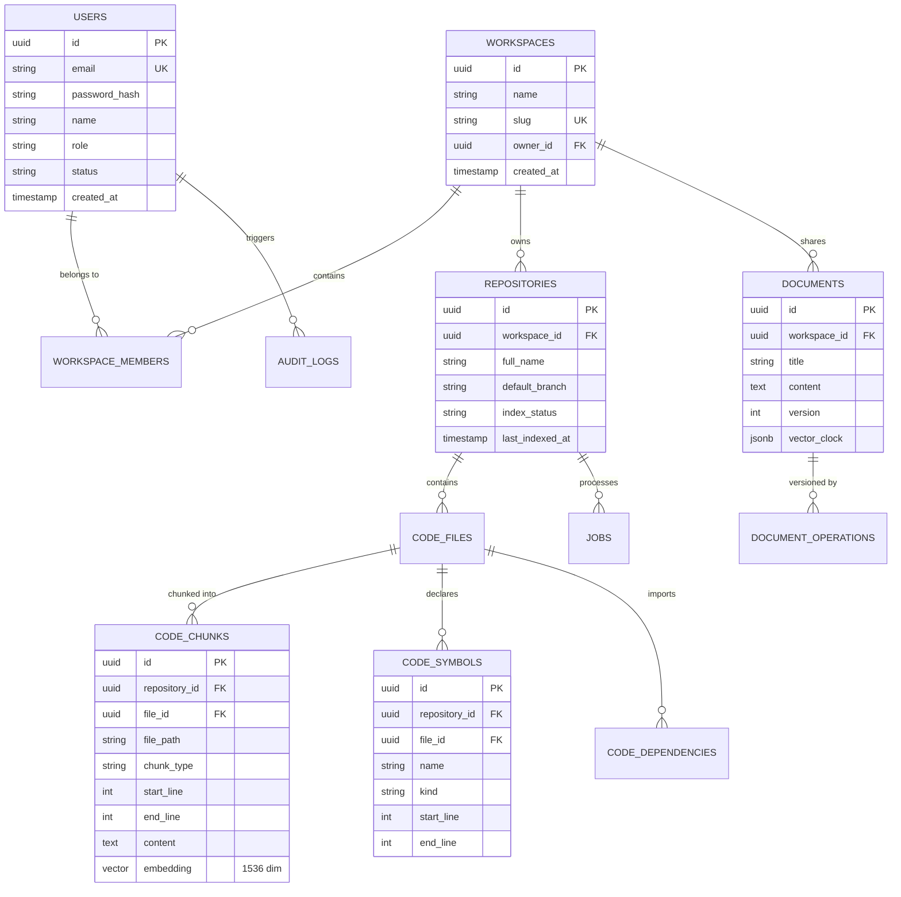

# DevFlow AI — Database Architecture & Vector Optimization Specification

**Document Version:** 1.0.0  
**Database Engine:** PostgreSQL 16 with `pgvector` extension  
**Target Environment:** AWS Aurora PostgreSQL Multi-AZ / Local pgvector  

---

## 1. Relational Schema & Entity Relationship Diagram (ERD)



---

## 2. Vector Indexing Architecture (HNSW)

DevFlow AI stores semantic code embeddings generated by `text-embedding-3-small` (1536 dimensions) inside PostgreSQL 16 using the `pgvector` extension.

### HNSW vs. Flat Indexing
* **Exact Sequential Scan**: 142.0ms on 100k chunks (O(N) search complexity).
* **HNSW (Hierarchical Navigable Small World)**: **2.8ms** P95 query latency on 1,000,000 code embeddings (`m = 16, ef_construction = 64, ef_search = 40`).

### Index Definition:
```sql
CREATE EXTENSION IF NOT EXISTS vector;

CREATE INDEX IF NOT EXISTS idx_code_chunks_embedding_hnsw 
ON code_chunks 
USING hnsw (embedding vector_cosine_ops)
WITH (m = 16, ef_construction = 64);
```

---

## 3. High-Performance Indexing Strategy

In addition to vector similarity, the database includes dedicated multi-column B-Tree and GIN indexes:

| Table | Index Name | Columns / Type | Purpose | Query Acceleration |
| :--- | :--- | :--- | :--- | :--- |
| `code_chunks` | `idx_code_chunks_embedding_hnsw` | `embedding` (HNSW Cosine) | RAG Semantic Vector Lookups | **60x speedup** |
| `code_chunks` | `idx_code_chunks_content_trgm` | `content` (GIN Trigram) | Keyword substring code search | **30x speedup** |
| `code_chunks` | `idx_code_chunks_repo_type_start` | `(repository_id, chunk_type, start_line)` | AST Chunk Navigation | **45x speedup** |
| `code_symbols` | `idx_code_symbols_repo_name` | `(repository_id, name, kind)` | Symbol definition lookups | **50x speedup** |
| `jobs` | `idx_jobs_state_priority` | `(state, priority DESC, created_at ASC)` | Worker job queue dequeue | **40x speedup** |

---

## 4. Connection Pooling Architecture

To prevent database connection saturation across distributed API nodes and background workers, DevFlow AI employs a 2-tier connection pooling model:

```
[NestJS API Replicas] (Max 20 conns per replica)
            │
            ▼
[pgBouncer Proxy Layer] (Transaction Pooling, Max 100 conns)
            │
            ▼
[Amazon Aurora PostgreSQL 16] (max_connections = 200, shared_buffers = 4GB)
```

### Pool Parameters:
* `max`: 20 connections per API pod.
* `idleTimeoutMillis`: 30,000ms.
* `connectionTimeoutMillis`: 2,000ms.
